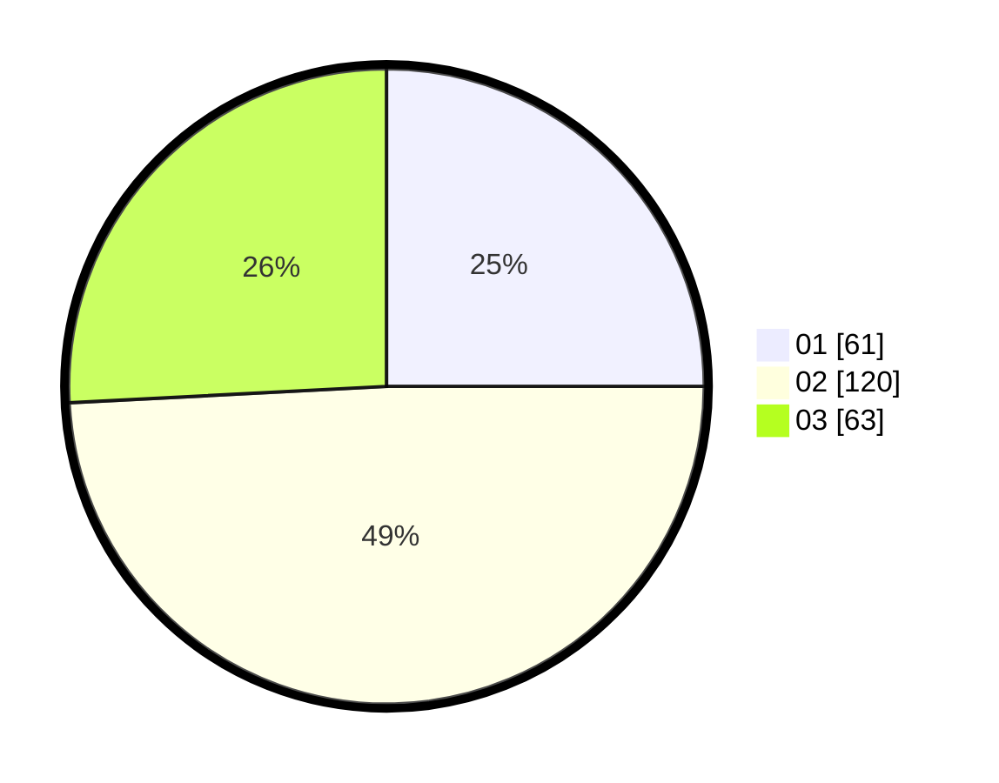

# Hasil

Hasil perolehan suara paslon dapat dilihat pada file paslon-01.txt, paslon-02.txt, dan paslon-03.txt.

Jika tidak ada, artinya data tersebut belum ada pada SIREKAP.

## Perolehan Suara

 * Paslon 01: **61**.
 * Paslon 02: **120**.
 * Paslon 03: **63**.

## Foto C Plano

https://sirekap-obj-formc.kpu.go.id/1da0/pemilu/ppwp/31/71/03/10/05/3171031005017-20240216-144804--7b25ac66-956e-4661-bfca-f42e6a085394.jpg

https://sirekap-obj-formc.kpu.go.id/1da0/pemilu/ppwp/31/71/03/10/05/3171031005017-20240216-144805--d3ba536e-3531-46ed-857a-8e329c2bc148.jpg

https://sirekap-obj-formc.kpu.go.id/1da0/pemilu/ppwp/31/71/03/10/05/3171031005017-20240216-144804--b58d8072-31ee-475f-a0e7-939756627380.jpg

## DATA PEMILIH TETAP

Jumlah pemilih dalam DPT: **293**.
 * L: **137**.
 * P: **156**.

## DATA PENGGUNA HAK PILIH

Jumlah pengguna hak pilih dalam DPT: **224**.
 * L: **98**.
 * P: **126**.

Jumlah pengguna hak pilih dalam DPTb: **16**.
 * L: **0**.
 * P: **16**.

Jumlah pengguna hak pilih dalam DPK: **4**.
 * L: **0**.
 * P: **4**.

Jumlah pengguna hak pilih: **244**.
 * L: **98**.
 * P: **146**.

## JUMLAH SUARA SAH DAN TIDAK SAH

JUMLAH SELURUH SUARA SAH: **244**.

JUMLAH SUARA TIDAK SAH: **0**.

JUMLAH SELURUH SUARA SAH DAN SUARA TIDAK SAH: **244**.
