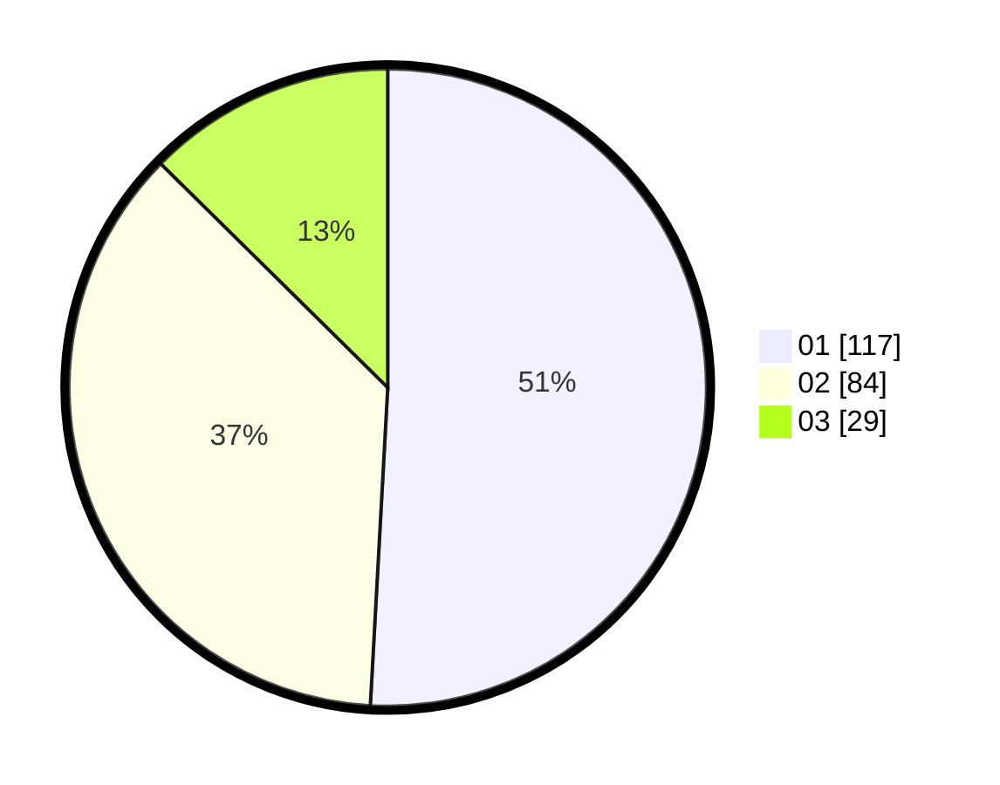

# Hasil

Hasil perolehan suara paslon dapat dilihat pada file paslon-01.txt, paslon-02.txt, dan paslon-03.txt.

Jika tidak ada, artinya data tersebut belum ada pada SIREKAP.

## Perolehan Suara

 * Paslon 01: **117**.
 * Paslon 02: **84**.
 * Paslon 03: **29**.

## Foto C Plano

https://sirekap-obj-formc.kpu.go.id/48a9/pemilu/ppwp/31/71/03/10/05/3171031005018-20240214-160151--3cfce984-d219-4ac3-8756-39f2998e4fe3.jpg

https://sirekap-obj-formc.kpu.go.id/48a9/pemilu/ppwp/31/71/03/10/05/3171031005018-20240214-200827--a8b3707a-5fdd-41ba-847b-56230374a45e.jpg

https://sirekap-obj-formc.kpu.go.id/48a9/pemilu/ppwp/31/71/03/10/05/3171031005018-20240214-201000--aeaa3d27-ce0e-47c9-98fc-a55c35a88ed2.jpg

## DATA PEMILIH TETAP

Jumlah pemilih dalam DPT: **289**.
 * L: **152**.
 * P: **137**.

## DATA PENGGUNA HAK PILIH

Jumlah pengguna hak pilih dalam DPT: **219**.
 * L: **110**.
 * P: **109**.

Jumlah pengguna hak pilih dalam DPTb: **12**.
 * L: **2**.
 * P: **10**.

Jumlah pengguna hak pilih dalam DPK: **3**.
 * L: **1**.
 * P: **2**.

Jumlah pengguna hak pilih: **234**.
 * L: **113**.
 * P: **121**.

## JUMLAH SUARA SAH DAN TIDAK SAH

JUMLAH SELURUH SUARA SAH: **230**.

JUMLAH SUARA TIDAK SAH: **4**.

JUMLAH SELURUH SUARA SAH DAN SUARA TIDAK SAH: **234**.
