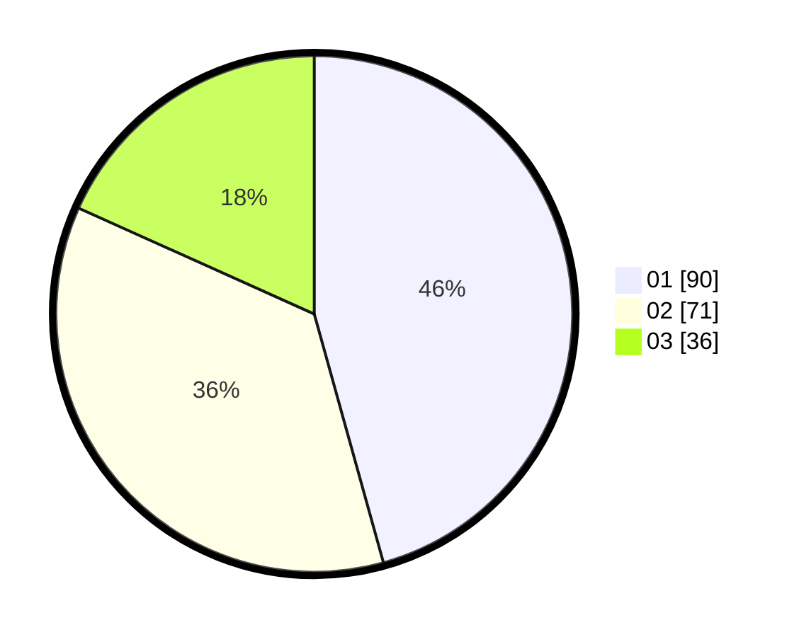

# Hasil

Hasil perolehan suara paslon dapat dilihat pada file paslon-01.txt, paslon-02.txt, dan paslon-03.txt.

Jika tidak ada, artinya data tersebut belum ada pada SIREKAP.

## Perolehan Suara

 * Paslon 01: **90**.
 * Paslon 02: **71**.
 * Paslon 03: **36**.

## Foto C Plano

https://sirekap-obj-formc.kpu.go.id/59d6/pemilu/ppwp/31/71/03/10/05/3171031005022-20240217-174826--27ad30cc-3b7c-4adc-8ed8-96f2da2ba3bc.jpg

https://sirekap-obj-formc.kpu.go.id/59d6/pemilu/ppwp/31/71/03/10/05/3171031005022-20240217-174827--b5d4a74f-dd57-4d3a-9cc5-1baf23e926be.jpg

https://sirekap-obj-formc.kpu.go.id/59d6/pemilu/ppwp/31/71/03/10/05/3171031005022-20240217-174826--b236b7d8-e9ba-4216-959c-6ec99c5248d5.jpg

## DATA PEMILIH TETAP

Jumlah pemilih dalam DPT: **275**.
 * L: **136**.
 * P: **139**.

## DATA PENGGUNA HAK PILIH

Jumlah pengguna hak pilih dalam DPT: **193**.
 * L: **89**.
 * P: **104**.

Jumlah pengguna hak pilih dalam DPTb: **7**.
 * L: **1**.
 * P: **6**.

Jumlah pengguna hak pilih dalam DPK: **0**.
 * L: **0**.
 * P: **0**.

Jumlah pengguna hak pilih: **200**.
 * L: **90**.
 * P: **110**.

## JUMLAH SUARA SAH DAN TIDAK SAH

JUMLAH SELURUH SUARA SAH: **197**.

JUMLAH SUARA TIDAK SAH: **2**.

JUMLAH SELURUH SUARA SAH DAN SUARA TIDAK SAH: **199**.
