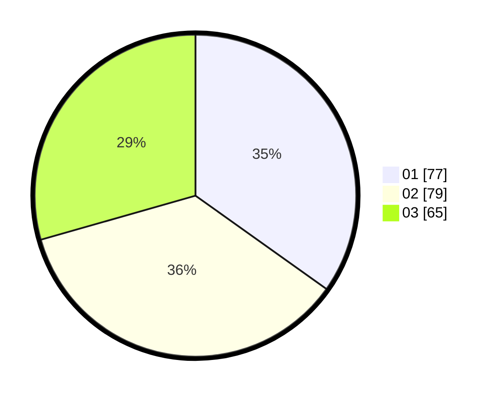

# Hasil

Hasil perolehan suara paslon dapat dilihat pada file paslon-01.txt, paslon-02.txt, dan paslon-03.txt.

Jika tidak ada, artinya data tersebut belum ada pada SIREKAP.

## Perolehan Suara

 * Paslon 01: **77**.
 * Paslon 02: **79**.
 * Paslon 03: **65**.

## Foto C Plano

https://sirekap-obj-formc.kpu.go.id/de06/pemilu/ppwp/31/71/03/10/05/3171031005026-20240217-204211--9094c3e0-df80-46e8-8593-1fad4b5de5f4.jpg

https://sirekap-obj-formc.kpu.go.id/de06/pemilu/ppwp/31/71/03/10/05/3171031005026-20240217-210340--1c3b9803-e3da-44a2-ac1d-b72b663fe75c.jpg

https://sirekap-obj-formc.kpu.go.id/de06/pemilu/ppwp/31/71/03/10/05/3171031005026-20240217-210339--0783a58f-2bff-4024-8de9-c0e01d1b7198.jpg

## DATA PEMILIH TETAP

Jumlah pemilih dalam DPT: **279**.
 * L: **135**.
 * P: **144**.

## DATA PENGGUNA HAK PILIH

Jumlah pengguna hak pilih dalam DPT: **205**.
 * L: **102**.
 * P: **103**.

Jumlah pengguna hak pilih dalam DPTb: **20**.
 * L: **12**.
 * P: **8**.

Jumlah pengguna hak pilih dalam DPK: **0**.
 * L: **0**.
 * P: **0**.

Jumlah pengguna hak pilih: **225**.
 * L: **114**.
 * P: **111**.

## JUMLAH SUARA SAH DAN TIDAK SAH

JUMLAH SELURUH SUARA SAH: **221**.

JUMLAH SUARA TIDAK SAH: **4**.

JUMLAH SELURUH SUARA SAH DAN SUARA TIDAK SAH: **225**.
