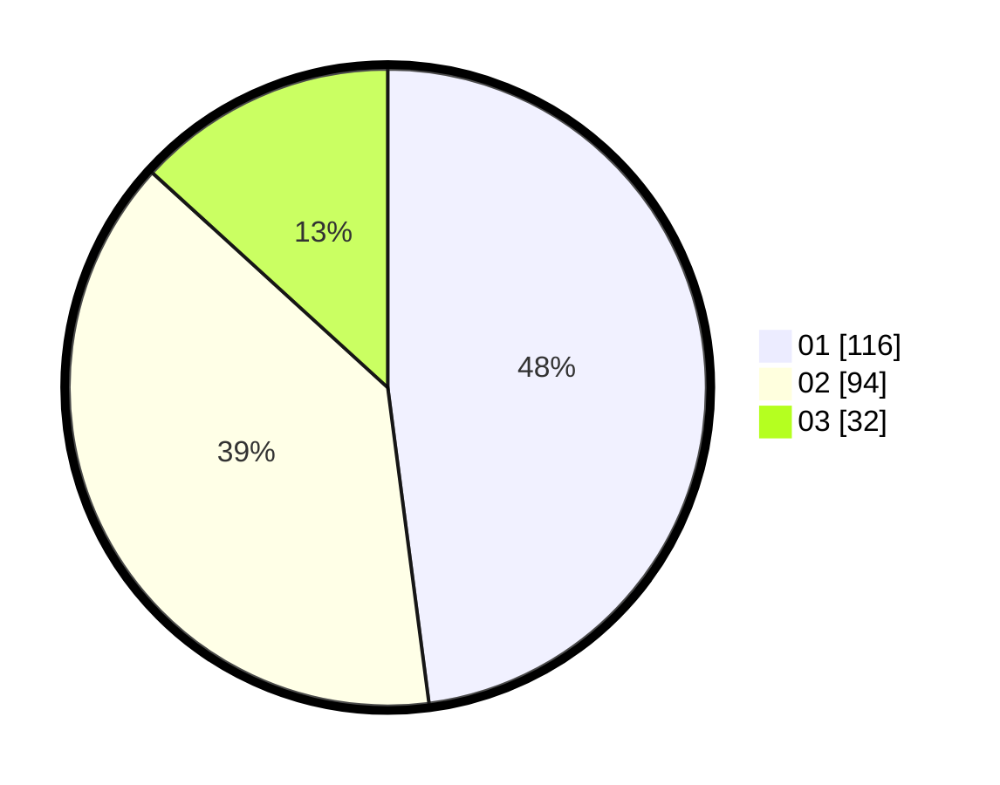

# Hasil

Hasil perolehan suara paslon dapat dilihat pada file paslon-01.txt, paslon-02.txt, dan paslon-03.txt.

Jika tidak ada, artinya data tersebut belum ada pada SIREKAP.

## Perolehan Suara

 * Paslon 01: **116**.
 * Paslon 02: **94**.
 * Paslon 03: **32**.

## Foto C Plano

https://sirekap-obj-formc.kpu.go.id/81c1/pemilu/ppwp/31/71/03/10/05/3171031005031-20240217-222615--c8248b45-06d8-4f25-bd50-3914f5067bb0.jpg

https://sirekap-obj-formc.kpu.go.id/81c1/pemilu/ppwp/31/71/03/10/05/3171031005031-20240217-222617--0e8d30d0-7230-48cb-8129-d3d23656dc19.jpg

https://sirekap-obj-formc.kpu.go.id/81c1/pemilu/ppwp/31/71/03/10/05/3171031005031-20240217-222616--6fd21b7c-2da2-4fda-b2b1-6edeb7ee15bc.jpg

## DATA PEMILIH TETAP

Jumlah pemilih dalam DPT: **293**.
 * L: **146**.
 * P: **147**.

## DATA PENGGUNA HAK PILIH

Jumlah pengguna hak pilih dalam DPT: **240**.
 * L: **117**.
 * P: **123**.

Jumlah pengguna hak pilih dalam DPTb: **6**.
 * L: **3**.
 * P: **3**.

Jumlah pengguna hak pilih dalam DPK: **1**.
 * L: **1**.
 * P: **0**.

Jumlah pengguna hak pilih: **247**.
 * L: **121**.
 * P: **126**.

## JUMLAH SUARA SAH DAN TIDAK SAH

JUMLAH SELURUH SUARA SAH: **242**.

JUMLAH SUARA TIDAK SAH: **5**.

JUMLAH SELURUH SUARA SAH DAN SUARA TIDAK SAH: **247**.
