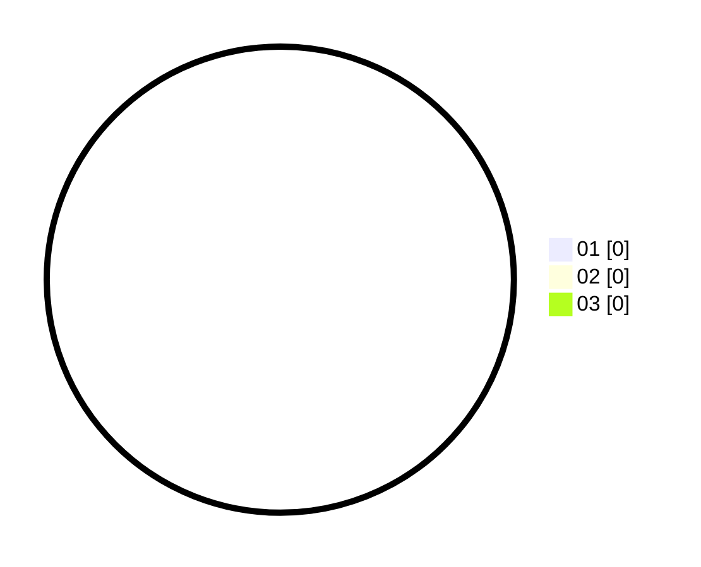

# Hasil

Hasil perolehan suara paslon dapat dilihat pada file paslon-01.txt, paslon-02.txt, dan paslon-03.txt.

Jika tidak ada, artinya data tersebut belum ada pada SIREKAP.

## Perolehan Suara

 * Paslon 01: **0**.
 * Paslon 02: **0**.
 * Paslon 03: **0**.

## Foto C Plano

https://sirekap-obj-formc.kpu.go.id/6b26/pemilu/ppwp/31/71/03/10/05/3171031005033-20240216-151302--9f643e58-64e4-4144-b7b9-60cdf5d32aa9.jpg

https://sirekap-obj-formc.kpu.go.id/6b26/pemilu/ppwp/31/71/03/10/05/3171031005033-20240216-151303--742b1b1a-ca9c-42c5-a2fb-c8cb4adb6e20.jpg

https://sirekap-obj-formc.kpu.go.id/6b26/pemilu/ppwp/31/71/03/10/05/3171031005033-20240216-151303--6e868cf7-9d2b-47b9-874a-c729d0b948e5.jpg

## DATA PEMILIH TETAP

Jumlah pemilih dalam DPT: **281**.
 * L: **140**.
 * P: **141**.

## DATA PENGGUNA HAK PILIH

Jumlah pengguna hak pilih dalam DPT: **281**.
 * L: **140**.
 * P: **141**.

Jumlah pengguna hak pilih dalam DPTb: **12**.
 * L: **8**.
 * P: **4**.

Jumlah pengguna hak pilih dalam DPK: **0**.
 * L: **0**.
 * P: **0**.

Jumlah pengguna hak pilih: **0**.
 * L: **0**.
 * P: **0**.

## JUMLAH SUARA SAH DAN TIDAK SAH

JUMLAH SELURUH SUARA SAH: **221**.

JUMLAH SUARA TIDAK SAH: **1**.

JUMLAH SELURUH SUARA SAH DAN SUARA TIDAK SAH: **222**.
