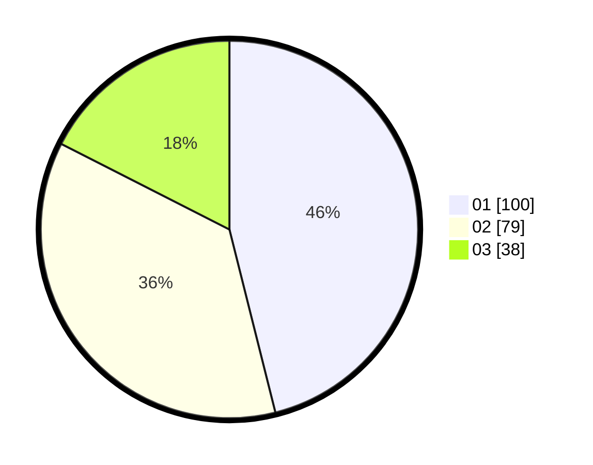

# Hasil

Hasil perolehan suara paslon dapat dilihat pada file paslon-01.txt, paslon-02.txt, dan paslon-03.txt.

Jika tidak ada, artinya data tersebut belum ada pada SIREKAP.

## Perolehan Suara

 * Paslon 01: **100**.
 * Paslon 02: **79**.
 * Paslon 03: **38**.

## Foto C Plano

https://sirekap-obj-formc.kpu.go.id/8781/pemilu/ppwp/31/71/03/10/05/3171031005035-20240216-002306--68f1f810-b9c9-4760-a6c9-fb7a462a784c.jpg

https://sirekap-obj-formc.kpu.go.id/8781/pemilu/ppwp/31/71/03/10/05/3171031005035-20240216-002308--cd4b06c8-5307-4f37-b84e-bc79394c8a2e.jpg

https://sirekap-obj-formc.kpu.go.id/8781/pemilu/ppwp/31/71/03/10/05/3171031005035-20240216-002307--9914823d-8c9a-4142-9451-9cca35aeb15f.jpg

## DATA PEMILIH TETAP

Jumlah pemilih dalam DPT: **275**.
 * L: **145**.
 * P: **130**.

## DATA PENGGUNA HAK PILIH

Jumlah pengguna hak pilih dalam DPT: **203**.
 * L: **107**.
 * P: **96**.

Jumlah pengguna hak pilih dalam DPTb: **203**.
 * L: **107**.
 * P: **96**.

Jumlah pengguna hak pilih dalam DPK: **2**.
 * L: **1**.
 * P: **1**.

Jumlah pengguna hak pilih: **218**.
 * L: **112**.
 * P: **106**.

## JUMLAH SUARA SAH DAN TIDAK SAH

JUMLAH SELURUH SUARA SAH: **217**.

JUMLAH SUARA TIDAK SAH: **1**.

JUMLAH SELURUH SUARA SAH DAN SUARA TIDAK SAH: **218**.
