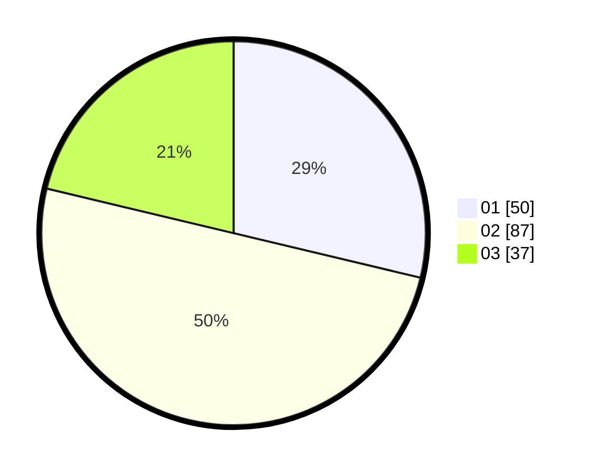

# Hasil

Hasil perolehan suara paslon dapat dilihat pada file paslon-01.txt, paslon-02.txt, dan paslon-03.txt.

Jika tidak ada, artinya data tersebut belum ada pada SIREKAP.

## Perolehan Suara

 * Paslon 01: **50**.
 * Paslon 02: **87**.
 * Paslon 03: **37**.

## Foto C Plano

https://sirekap-obj-formc.kpu.go.id/ce9e/pemilu/ppwp/31/71/03/10/05/3171031005040-20240216-064229--5871bf75-8c26-4a88-be5c-c886852c1c6d.jpg

https://sirekap-obj-formc.kpu.go.id/ce9e/pemilu/ppwp/31/71/03/10/05/3171031005040-20240216-061622--04d112e8-e4c4-47d3-9741-0574228b47c2.jpg
