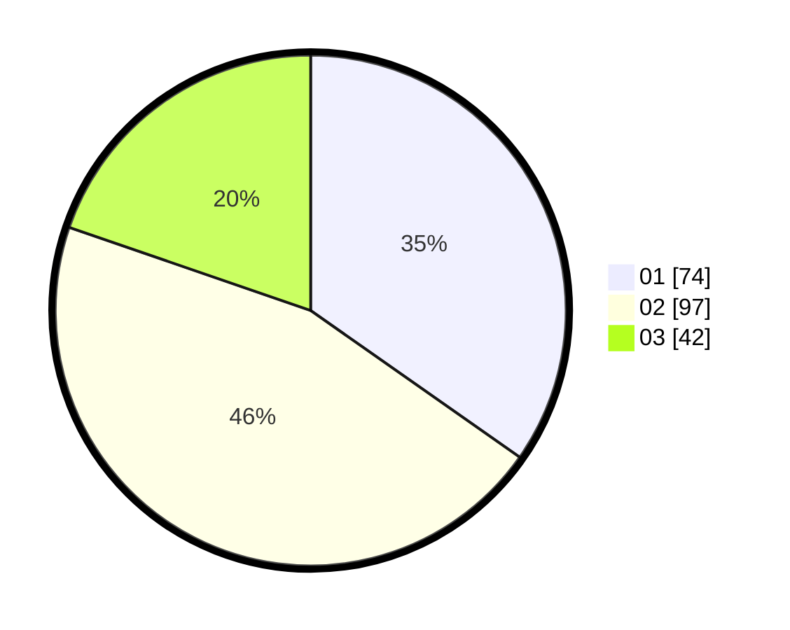

# Hasil

Hasil perolehan suara paslon dapat dilihat pada file paslon-01.txt, paslon-02.txt, dan paslon-03.txt.

Jika tidak ada, artinya data tersebut belum ada pada SIREKAP.

## Perolehan Suara

 * Paslon 01: **74**.
 * Paslon 02: **97**.
 * Paslon 03: **42**.

## Foto C Plano

https://sirekap-obj-formc.kpu.go.id/d357/pemilu/ppwp/31/71/03/10/05/3171031005042-20240214-235634--86dc7d38-1e4a-4b1e-8dfb-ba31108042a6.jpg

https://sirekap-obj-formc.kpu.go.id/d357/pemilu/ppwp/31/71/03/10/05/3171031005042-20240214-235515--5676cbe5-5c5f-43d1-a974-70b4cd261e69.jpg

https://sirekap-obj-formc.kpu.go.id/d357/pemilu/ppwp/31/71/03/10/05/3171031005042-20240214-235912--151b6ae3-eb93-476a-8304-051c260fff89.jpg
