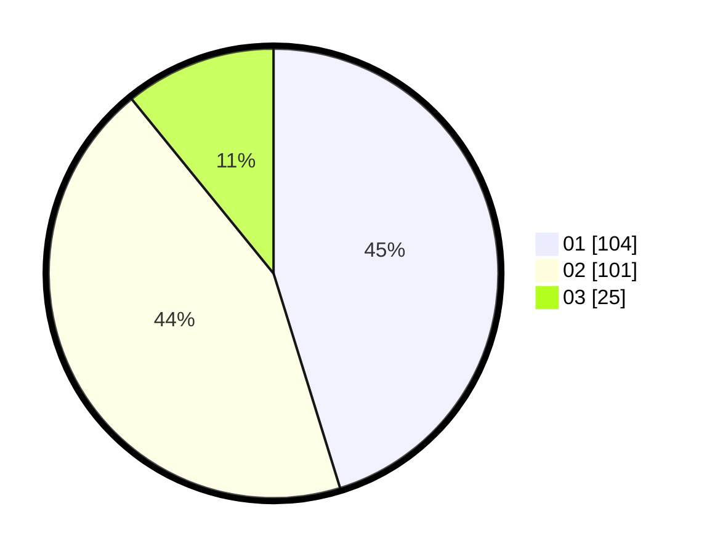

# Hasil

Hasil perolehan suara paslon dapat dilihat pada file paslon-01.txt, paslon-02.txt, dan paslon-03.txt.

Jika tidak ada, artinya data tersebut belum ada pada SIREKAP.

## Perolehan Suara

 * Paslon 01: **104**.
 * Paslon 02: **101**.
 * Paslon 03: **25**.

## Foto C Plano

https://sirekap-obj-formc.kpu.go.id/4c98/pemilu/ppwp/31/71/03/10/05/3171031005044-20240216-151823--bcf3103e-172f-4d80-89b8-3affe4274ee7.jpg

https://sirekap-obj-formc.kpu.go.id/4c98/pemilu/ppwp/31/71/03/10/05/3171031005044-20240216-150348--3d46fc9d-6de0-49b0-954e-6c236aa3186a.jpg

https://sirekap-obj-formc.kpu.go.id/4c98/pemilu/ppwp/31/71/03/10/05/3171031005044-20240216-150541--ad97dbe7-a9fc-47a5-bfff-b91f3a50854d.jpg
