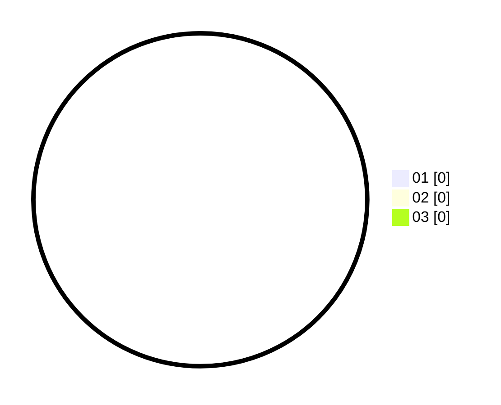

# Hasil

Hasil perolehan suara paslon dapat dilihat pada file paslon-01.txt, paslon-02.txt, dan paslon-03.txt.

Jika tidak ada, artinya data tersebut belum ada pada SIREKAP.

## Perolehan Suara

 * Paslon 01: **0**.
 * Paslon 02: **0**.
 * Paslon 03: **0**.

## Foto C Plano

https://sirekap-obj-formc.kpu.go.id/93f2/pemilu/ppwp/31/71/03/10/05/3171031005052-20240216-032525--127ead2f-9db7-4c93-86d7-8312cc64a7a5.jpg

https://sirekap-obj-formc.kpu.go.id/93f2/pemilu/ppwp/31/71/03/10/05/3171031005052-20240216-030625--131216c0-11ae-4637-9c29-69c78deed53d.jpg

https://sirekap-obj-formc.kpu.go.id/93f2/pemilu/ppwp/31/71/03/10/05/3171031005052-20240216-030619--4d08e8d8-d99b-42d1-936e-108519ce48b5.jpg

## DATA PEMILIH TETAP

Jumlah pemilih dalam DPT: **224**.
 * L: **187**.
 * P: **37**.

## DATA PENGGUNA HAK PILIH

Jumlah pengguna hak pilih dalam DPT: **50**.
 * L: **24**.
 * P: **26**.

Jumlah pengguna hak pilih dalam DPTb: **7**.
 * L: **2**.
 * P: **5**.

Jumlah pengguna hak pilih dalam DPK: **10**.
 * L: **9**.
 * P: **1**.

Jumlah pengguna hak pilih: **67**.
 * L: **35**.
 * P: **32**.

## JUMLAH SUARA SAH DAN TIDAK SAH

JUMLAH SELURUH SUARA SAH: **64**.

JUMLAH SUARA TIDAK SAH: **3**.

JUMLAH SELURUH SUARA SAH DAN SUARA TIDAK SAH: **67**.
