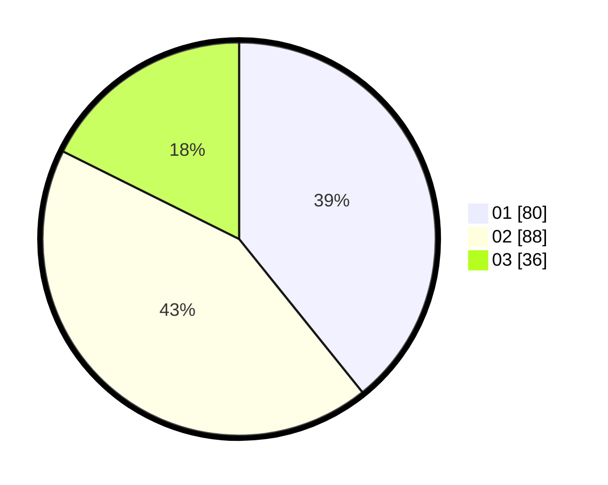

# Hasil

Hasil perolehan suara paslon dapat dilihat pada file paslon-01.txt, paslon-02.txt, dan paslon-03.txt.

Jika tidak ada, artinya data tersebut belum ada pada SIREKAP.

## Perolehan Suara

 * Paslon 01: **80**.
 * Paslon 02: **88**.
 * Paslon 03: **36**.

## Foto C Plano

https://sirekap-obj-formc.kpu.go.id/f5fa/pemilu/ppwp/31/71/03/10/05/3171031005053-20240217-164021--29ded35b-412f-41f8-b448-6404c9d8bf6c.jpg

https://sirekap-obj-formc.kpu.go.id/f5fa/pemilu/ppwp/31/71/03/10/05/3171031005053-20240217-164022--d4733573-dc06-4b8f-8be4-1c2058296ab5.jpg

https://sirekap-obj-formc.kpu.go.id/f5fa/pemilu/ppwp/31/71/03/10/05/3171031005053-20240217-164022--18bd976b-6765-44c0-b529-d9463c9f2b00.jpg

## DATA PEMILIH TETAP

Jumlah pemilih dalam DPT: **271**.
 * L: **122**.
 * P: **149**.

## DATA PENGGUNA HAK PILIH

Jumlah pengguna hak pilih dalam DPT: **203**.
 * L: **93**.
 * P: **110**.

Jumlah pengguna hak pilih dalam DPTb: **4**.
 * L: **1**.
 * P: **3**.

Jumlah pengguna hak pilih dalam DPK: **0**.
 * L: **0**.
 * P: **0**.

Jumlah pengguna hak pilih: **207**.
 * L: **94**.
 * P: **113**.

## JUMLAH SUARA SAH DAN TIDAK SAH

JUMLAH SELURUH SUARA SAH: **204**.

JUMLAH SUARA TIDAK SAH: **3**.

JUMLAH SELURUH SUARA SAH DAN SUARA TIDAK SAH: **207**.
