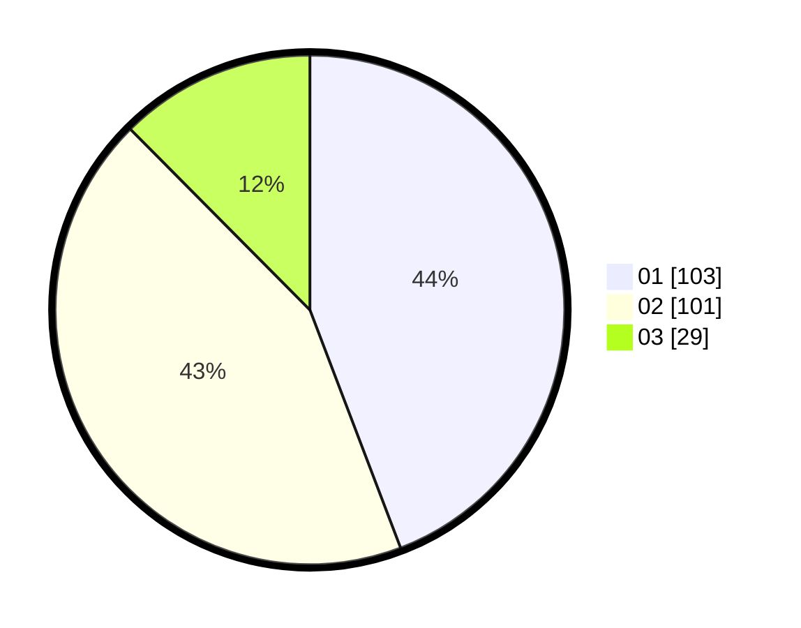

# Hasil

Hasil perolehan suara paslon dapat dilihat pada file paslon-01.txt, paslon-02.txt, dan paslon-03.txt.

Jika tidak ada, artinya data tersebut belum ada pada SIREKAP.

## Perolehan Suara

 * Paslon 01: **103**.
 * Paslon 02: **101**.
 * Paslon 03: **29**.

## Foto C Plano

https://sirekap-obj-formc.kpu.go.id/44d8/pemilu/ppwp/31/71/03/10/05/3171031005064-20240216-141212--55486243-70b1-4a06-96ea-070e6442c045.jpg

https://sirekap-obj-formc.kpu.go.id/44d8/pemilu/ppwp/31/71/03/10/05/3171031005064-20240216-141214--5dbab185-1025-4edb-8abe-294347154431.jpg

https://sirekap-obj-formc.kpu.go.id/44d8/pemilu/ppwp/31/71/03/10/05/3171031005064-20240216-141213--8d726da1-2ca1-4bc8-9ac1-c708f4bcbe4e.jpg

## DATA PEMILIH TETAP

Jumlah pemilih dalam DPT: **272**.
 * L: **122**.
 * P: **150**.

## DATA PENGGUNA HAK PILIH

Jumlah pengguna hak pilih dalam DPT: **225**.
 * L: **97**.
 * P: **128**.

Jumlah pengguna hak pilih dalam DPTb: **5**.
 * L: **3**.
 * P: **2**.

Jumlah pengguna hak pilih dalam DPK: **1**.
 * L: **1**.
 * P: **0**.

Jumlah pengguna hak pilih: **231**.
 * L: **101**.
 * P: **130**.

## JUMLAH SUARA SAH DAN TIDAK SAH

JUMLAH SELURUH SUARA SAH: **233**.

JUMLAH SUARA TIDAK SAH: **0**.

JUMLAH SELURUH SUARA SAH DAN SUARA TIDAK SAH: **233**.
