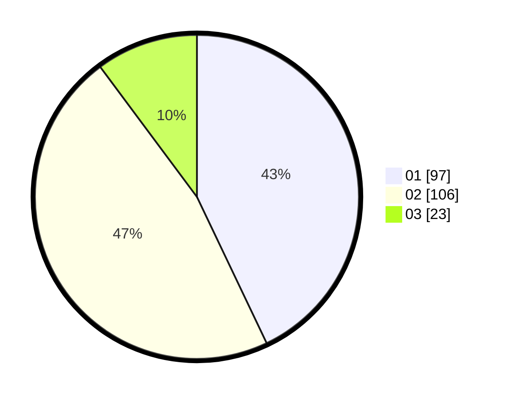

# Hasil

Hasil perolehan suara paslon dapat dilihat pada file paslon-01.txt, paslon-02.txt, dan paslon-03.txt.

Jika tidak ada, artinya data tersebut belum ada pada SIREKAP.

## Perolehan Suara

 * Paslon 01: **97**.
 * Paslon 02: **106**.
 * Paslon 03: **23**.

## Foto C Plano

https://sirekap-obj-formc.kpu.go.id/d8f3/pemilu/ppwp/31/71/03/10/06/3171031006002-20240214-201945--1e4c6831-8e54-4e20-9474-22aa280e0808.jpg

https://sirekap-obj-formc.kpu.go.id/d8f3/pemilu/ppwp/31/71/03/10/06/3171031006002-20240214-202118--47e061df-ab1f-4a12-8c7c-9434e5c44bee.jpg

https://sirekap-obj-formc.kpu.go.id/d8f3/pemilu/ppwp/31/71/03/10/06/3171031006002-20240214-202238--87622dbe-8273-45ee-9188-498a0bbb6489.jpg

## DATA PEMILIH TETAP

Jumlah pemilih dalam DPT: **278**.
 * L: **137**.
 * P: **141**.

## DATA PENGGUNA HAK PILIH

Jumlah pengguna hak pilih dalam DPT: **225**.
 * L: **109**.
 * P: **116**.

Jumlah pengguna hak pilih dalam DPTb: **2**.
 * L: **0**.
 * P: **2**.

Jumlah pengguna hak pilih dalam DPK: **1**.
 * L: **1**.
 * P: **0**.

Jumlah pengguna hak pilih: **228**.
 * L: **110**.
 * P: **118**.

## JUMLAH SUARA SAH DAN TIDAK SAH

JUMLAH SELURUH SUARA SAH: **226**.

JUMLAH SUARA TIDAK SAH: **2**.

JUMLAH SELURUH SUARA SAH DAN SUARA TIDAK SAH: **228**.
