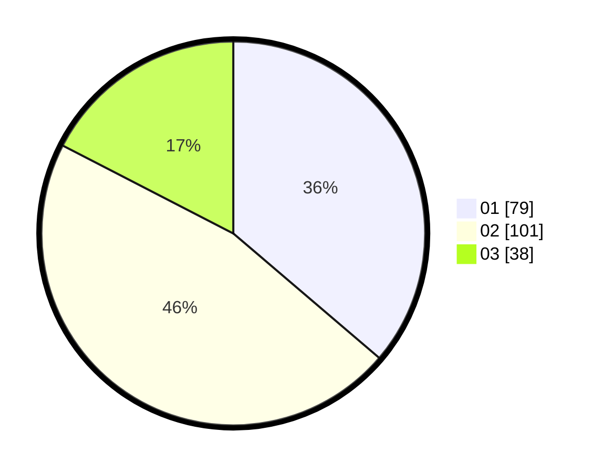

# Hasil

Hasil perolehan suara paslon dapat dilihat pada file paslon-01.txt, paslon-02.txt, dan paslon-03.txt.

Jika tidak ada, artinya data tersebut belum ada pada SIREKAP.

## Perolehan Suara

 * Paslon 01: **79**.
 * Paslon 02: **101**.
 * Paslon 03: **38**.

## Foto C Plano

https://sirekap-obj-formc.kpu.go.id/b3e7/pemilu/ppwp/31/71/03/10/06/3171031006004-20240215-003705--9476c50f-509c-441c-94e3-d53e85ae1c25.jpg

https://sirekap-obj-formc.kpu.go.id/b3e7/pemilu/ppwp/31/71/03/10/06/3171031006004-20240215-001906--36a43946-f64b-49da-8bf2-ef2e068f75b7.jpg

https://sirekap-obj-formc.kpu.go.id/b3e7/pemilu/ppwp/31/71/03/10/06/3171031006004-20240215-002109--a791c742-5263-465d-a272-8629bd0a3f83.jpg

## DATA PEMILIH TETAP

Jumlah pemilih dalam DPT: **293**.
 * L: **147**.
 * P: **146**.

## DATA PENGGUNA HAK PILIH

Jumlah pengguna hak pilih dalam DPT: **216**.
 * L: **107**.
 * P: **109**.

Jumlah pengguna hak pilih dalam DPTb: **0**.
 * L: **0**.
 * P: **0**.

Jumlah pengguna hak pilih dalam DPK: **5**.
 * L: **2**.
 * P: **3**.

Jumlah pengguna hak pilih: **221**.
 * L: **109**.
 * P: **112**.

## JUMLAH SUARA SAH DAN TIDAK SAH

JUMLAH SELURUH SUARA SAH: **218**.

JUMLAH SUARA TIDAK SAH: **3**.

JUMLAH SELURUH SUARA SAH DAN SUARA TIDAK SAH: **221**.
