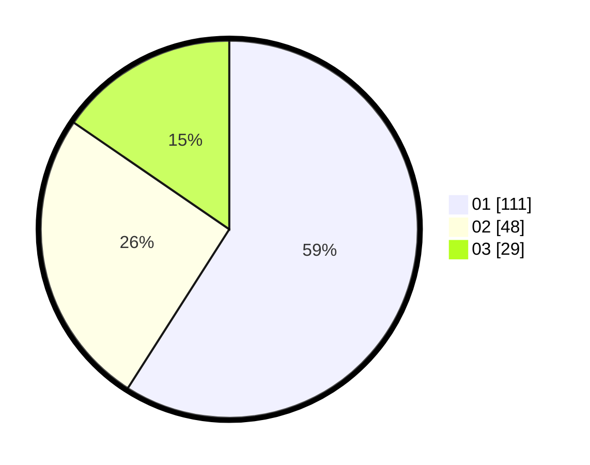

# Hasil

Hasil perolehan suara paslon dapat dilihat pada file paslon-01.txt, paslon-02.txt, dan paslon-03.txt.

Jika tidak ada, artinya data tersebut belum ada pada SIREKAP.

## Perolehan Suara

 * Paslon 01: **111**.
 * Paslon 02: **48**.
 * Paslon 03: **29**.

## Foto C Plano

https://sirekap-obj-formc.kpu.go.id/b044/pemilu/ppwp/31/71/03/10/06/3171031006007-20240214-212156--b1d787c8-5eff-4041-9450-025cf4d0aac9.jpg

https://sirekap-obj-formc.kpu.go.id/b044/pemilu/ppwp/31/71/03/10/06/3171031006007-20240214-212356--39a61b8a-a0fa-4866-9f66-f5b148accaed.jpg

https://sirekap-obj-formc.kpu.go.id/b044/pemilu/ppwp/31/71/03/10/06/3171031006007-20240214-212502--82a8fc78-c27a-410a-a0fc-d7a23a0fd652.jpg

## DATA PEMILIH TETAP

Jumlah pemilih dalam DPT: **283**.
 * L: **140**.
 * P: **143**.

## DATA PENGGUNA HAK PILIH

Jumlah pengguna hak pilih dalam DPT: **188**.
 * L: **88**.
 * P: **100**.

Jumlah pengguna hak pilih dalam DPTb: **1**.
 * L: **0**.
 * P: **1**.

Jumlah pengguna hak pilih dalam DPK: **1**.
 * L: **0**.
 * P: **1**.

Jumlah pengguna hak pilih: **190**.
 * L: **88**.
 * P: **102**.

## JUMLAH SUARA SAH DAN TIDAK SAH

JUMLAH SELURUH SUARA SAH: **188**.

JUMLAH SUARA TIDAK SAH: **2**.

JUMLAH SELURUH SUARA SAH DAN SUARA TIDAK SAH: **190**.
