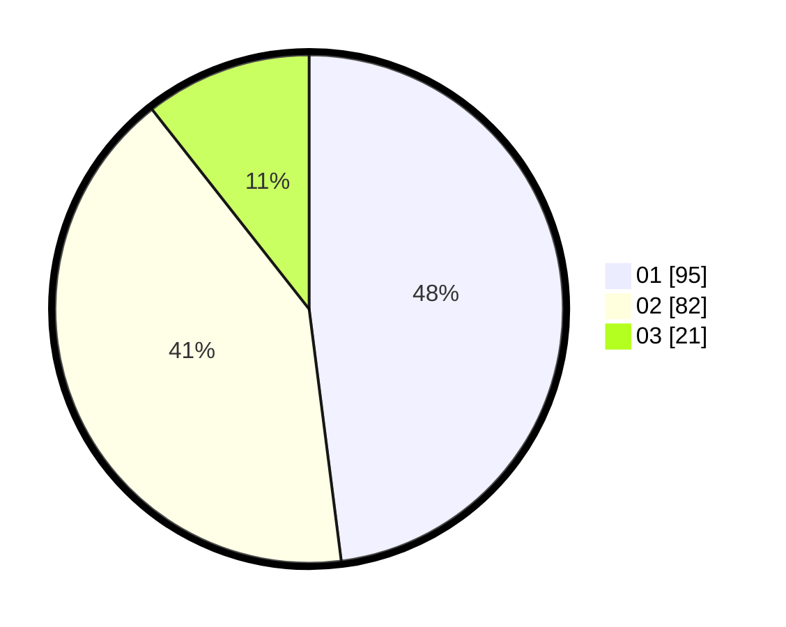

# Hasil

Hasil perolehan suara paslon dapat dilihat pada file paslon-01.txt, paslon-02.txt, dan paslon-03.txt.

Jika tidak ada, artinya data tersebut belum ada pada SIREKAP.

## Perolehan Suara

 * Paslon 01: **95**.
 * Paslon 02: **82**.
 * Paslon 03: **21**.

## Foto C Plano

https://sirekap-obj-formc.kpu.go.id/902c/pemilu/ppwp/31/71/03/10/06/3171031006009-20240215-012137--9b119634-4e47-42ae-853f-7ea82db7a443.jpg

https://sirekap-obj-formc.kpu.go.id/902c/pemilu/ppwp/31/71/03/10/06/3171031006009-20240215-012311--331522d3-b23f-46ee-a76a-5bec47a4d465.jpg

https://sirekap-obj-formc.kpu.go.id/902c/pemilu/ppwp/31/71/03/10/06/3171031006009-20240215-012601--ff295345-4bb9-4537-b948-2e82a502d3fa.jpg

## DATA PEMILIH TETAP

Jumlah pemilih dalam DPT: **284**.
 * L: **144**.
 * P: **140**.

## DATA PENGGUNA HAK PILIH

Jumlah pengguna hak pilih dalam DPT: **202**.
 * L: **105**.
 * P: **97**.

Jumlah pengguna hak pilih dalam DPTb: **0**.
 * L: **0**.
 * P: **0**.

Jumlah pengguna hak pilih dalam DPK: **0**.
 * L: **0**.
 * P: **0**.

Jumlah pengguna hak pilih: **202**.
 * L: **105**.
 * P: **97**.

## JUMLAH SUARA SAH DAN TIDAK SAH

JUMLAH SELURUH SUARA SAH: **198**.

JUMLAH SUARA TIDAK SAH: **4**.

JUMLAH SELURUH SUARA SAH DAN SUARA TIDAK SAH: **202**.
