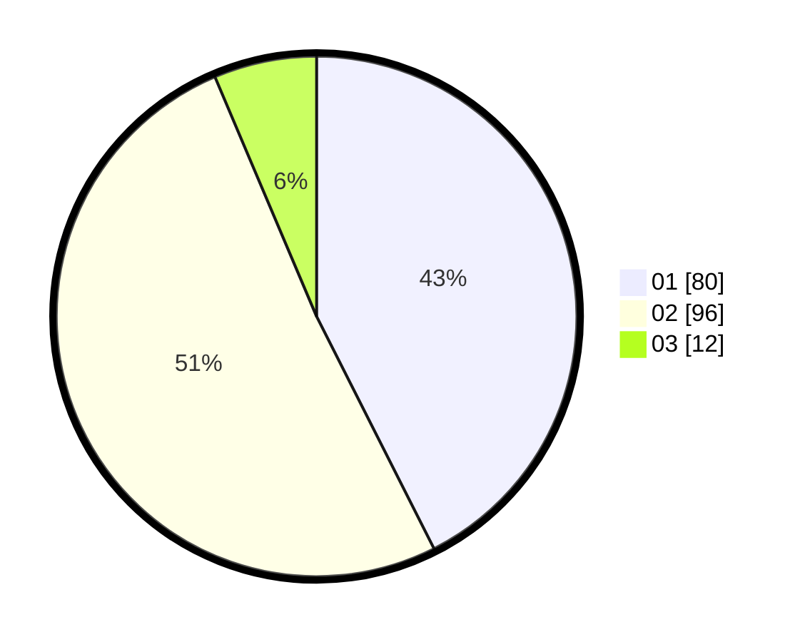

# Hasil

Hasil perolehan suara paslon dapat dilihat pada file paslon-01.txt, paslon-02.txt, dan paslon-03.txt.

Jika tidak ada, artinya data tersebut belum ada pada SIREKAP.

## Perolehan Suara

 * Paslon 01: **80**.
 * Paslon 02: **96**.
 * Paslon 03: **12**.

## Foto C Plano

https://sirekap-obj-formc.kpu.go.id/0f56/pemilu/ppwp/31/71/03/10/06/3171031006011-20240216-044428--0fc32dc9-d52b-41e8-ace5-748d936e87c7.jpg

https://sirekap-obj-formc.kpu.go.id/0f56/pemilu/ppwp/31/71/03/10/06/3171031006011-20240216-044440--7583f6cc-6d08-43d9-b47c-bfd4b0fc3be4.jpg

https://sirekap-obj-formc.kpu.go.id/0f56/pemilu/ppwp/31/71/03/10/06/3171031006011-20240216-044434--0c62c1ef-badf-4c26-9ea0-6b1b9aa50f46.jpg

## DATA PEMILIH TETAP

Jumlah pemilih dalam DPT: **267**.
 * L: **140**.
 * P: **127**.

## DATA PENGGUNA HAK PILIH

Jumlah pengguna hak pilih dalam DPT: **189**.
 * L: **90**.
 * P: **99**.

Jumlah pengguna hak pilih dalam DPTb: **0**.
 * L: **0**.
 * P: **0**.

Jumlah pengguna hak pilih dalam DPK: **1**.
 * L: **0**.
 * P: **1**.

Jumlah pengguna hak pilih: **190**.
 * L: **90**.
 * P: **100**.

## JUMLAH SUARA SAH DAN TIDAK SAH

JUMLAH SELURUH SUARA SAH: **189**.

JUMLAH SUARA TIDAK SAH: **1**.

JUMLAH SELURUH SUARA SAH DAN SUARA TIDAK SAH: **190**.
