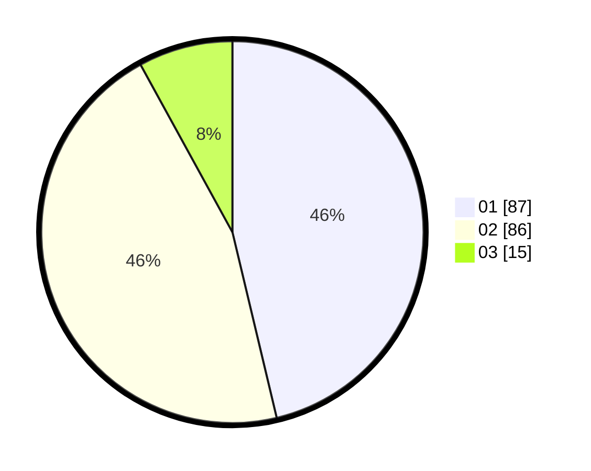

# Hasil

Hasil perolehan suara paslon dapat dilihat pada file paslon-01.txt, paslon-02.txt, dan paslon-03.txt.

Jika tidak ada, artinya data tersebut belum ada pada SIREKAP.

## Perolehan Suara

 * Paslon 01: **87**.
 * Paslon 02: **86**.
 * Paslon 03: **15**.

## Foto C Plano

https://sirekap-obj-formc.kpu.go.id/45c2/pemilu/ppwp/31/71/03/10/06/3171031006012-20240214-231948--a45082f0-4b22-4568-8797-dc581acdfa4f.jpg

https://sirekap-obj-formc.kpu.go.id/45c2/pemilu/ppwp/31/71/03/10/06/3171031006012-20240214-232625--3c4613fb-f522-4195-a901-224cc2779c66.jpg

https://sirekap-obj-formc.kpu.go.id/45c2/pemilu/ppwp/31/71/03/10/06/3171031006012-20240214-232841--67cb8c3f-71a7-4a86-978e-4cabdef2ab03.jpg
