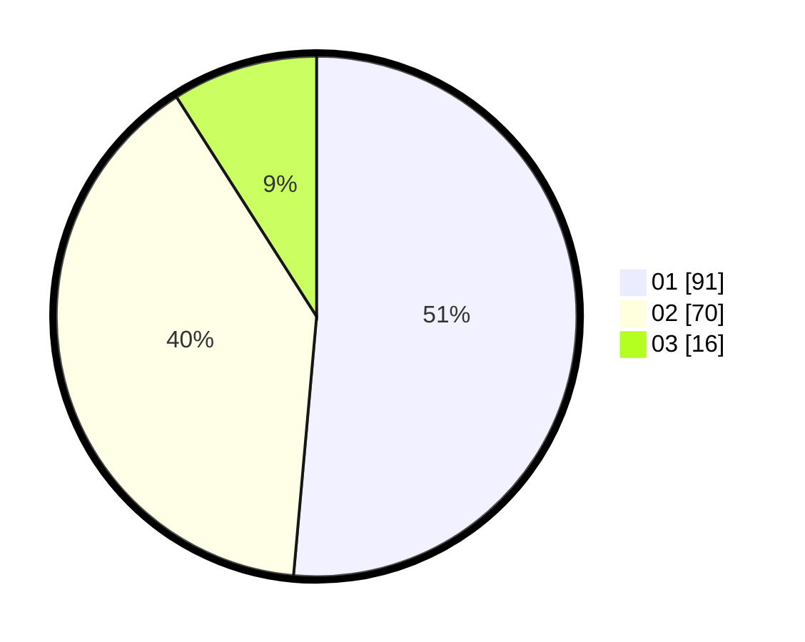

# Hasil

Hasil perolehan suara paslon dapat dilihat pada file paslon-01.txt, paslon-02.txt, dan paslon-03.txt.

Jika tidak ada, artinya data tersebut belum ada pada SIREKAP.

## Perolehan Suara

 * Paslon 01: **91**.
 * Paslon 02: **70**.
 * Paslon 03: **16**.

## Foto C Plano

https://sirekap-obj-formc.kpu.go.id/fb59/pemilu/ppwp/31/71/03/10/06/3171031006018-20240214-201250--0a8defc1-d6e7-4d41-a70a-122cdd2e2581.jpg

https://sirekap-obj-formc.kpu.go.id/fb59/pemilu/ppwp/31/71/03/10/06/3171031006018-20240214-204226--bb6fd581-f87b-46ed-8825-0f5857c3dace.jpg

https://sirekap-obj-formc.kpu.go.id/fb59/pemilu/ppwp/31/71/03/10/06/3171031006018-20240214-204245--b66b2ff9-b0f8-4931-8af8-6993891ff5eb.jpg

## DATA PEMILIH TETAP

Jumlah pemilih dalam DPT: **278**.
 * L: **146**.
 * P: **132**.

## DATA PENGGUNA HAK PILIH

Jumlah pengguna hak pilih dalam DPT: **179**.
 * L: **96**.
 * P: **83**.

Jumlah pengguna hak pilih dalam DPTb: **0**.
 * L: **0**.
 * P: **0**.

Jumlah pengguna hak pilih dalam DPK: **1**.
 * L: **1**.
 * P: **0**.

Jumlah pengguna hak pilih: **180**.
 * L: **97**.
 * P: **83**.

## JUMLAH SUARA SAH DAN TIDAK SAH

JUMLAH SELURUH SUARA SAH: **177**.

JUMLAH SUARA TIDAK SAH: **3**.

JUMLAH SELURUH SUARA SAH DAN SUARA TIDAK SAH: **180**.
