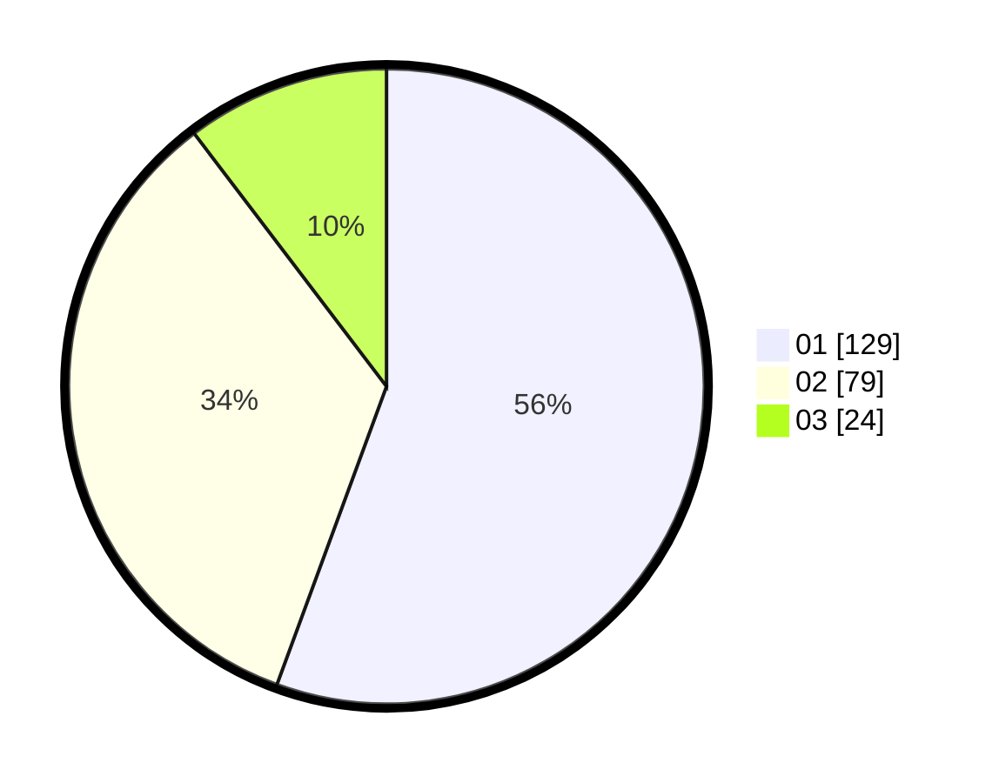

# Hasil

Hasil perolehan suara paslon dapat dilihat pada file paslon-01.txt, paslon-02.txt, dan paslon-03.txt.

Jika tidak ada, artinya data tersebut belum ada pada SIREKAP.

## Perolehan Suara

 * Paslon 01: **129**.
 * Paslon 02: **79**.
 * Paslon 03: **24**.

## Foto C Plano

https://sirekap-obj-formc.kpu.go.id/2ef0/pemilu/ppwp/31/71/03/10/06/3171031006021-20240216-151943--ba7bab84-3b34-488d-a08d-94ce2b607862.jpg

https://sirekap-obj-formc.kpu.go.id/2ef0/pemilu/ppwp/31/71/03/10/06/3171031006021-20240216-151945--351258a1-83ab-4bdc-aa57-5059a9a44a5c.jpg

https://sirekap-obj-formc.kpu.go.id/2ef0/pemilu/ppwp/31/71/03/10/06/3171031006021-20240216-151944--ff7cde13-a41d-4428-9781-26a9ae8a1754.jpg

## DATA PEMILIH TETAP

Jumlah pemilih dalam DPT: **277**.
 * L: **139**.
 * P: **138**.

## DATA PENGGUNA HAK PILIH

Jumlah pengguna hak pilih dalam DPT: **226**.
 * L: **112**.
 * P: **114**.

Jumlah pengguna hak pilih dalam DPTb: **6**.
 * L: **0**.
 * P: **6**.

Jumlah pengguna hak pilih dalam DPK: **0**.
 * L: **0**.
 * P: **0**.

Jumlah pengguna hak pilih: **232**.
 * L: **112**.
 * P: **120**.

## JUMLAH SUARA SAH DAN TIDAK SAH

JUMLAH SELURUH SUARA SAH: **232**.

JUMLAH SUARA TIDAK SAH: **0**.

JUMLAH SELURUH SUARA SAH DAN SUARA TIDAK SAH: **232**.
