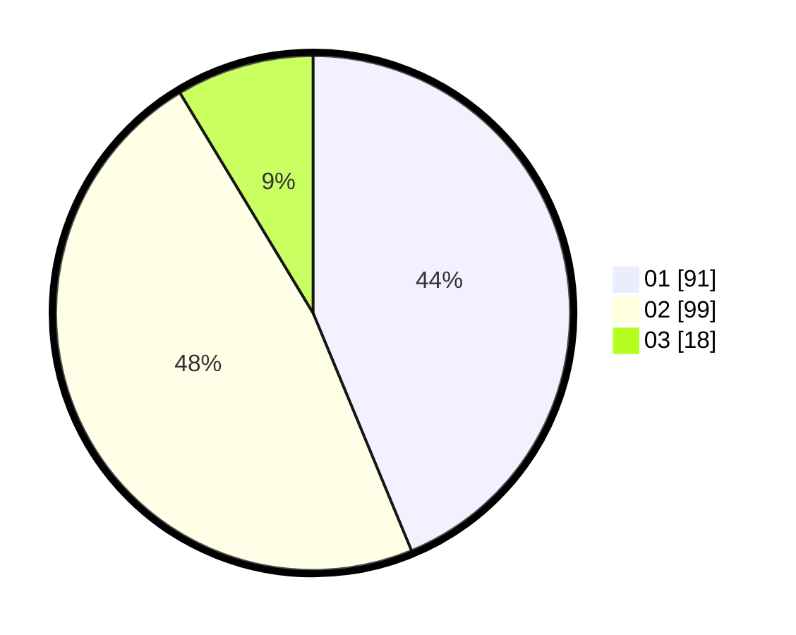

# Hasil

Hasil perolehan suara paslon dapat dilihat pada file paslon-01.txt, paslon-02.txt, dan paslon-03.txt.

Jika tidak ada, artinya data tersebut belum ada pada SIREKAP.

## Perolehan Suara

 * Paslon 01: **91**.
 * Paslon 02: **99**.
 * Paslon 03: **18**.

## Foto C Plano

https://sirekap-obj-formc.kpu.go.id/08da/pemilu/ppwp/31/71/03/10/06/3171031006022-20240216-144539--a1471eeb-48fd-4030-ad17-01179dc7b34e.jpg

https://sirekap-obj-formc.kpu.go.id/08da/pemilu/ppwp/31/71/03/10/06/3171031006022-20240216-144540--24cc94b2-08bf-46cb-bb89-b64468ce1fb2.jpg

https://sirekap-obj-formc.kpu.go.id/08da/pemilu/ppwp/31/71/03/10/06/3171031006022-20240216-144539--7ddf76f7-c97c-42ae-869a-c76bdc6d89ec.jpg

## DATA PEMILIH TETAP

Jumlah pemilih dalam DPT: **280**.
 * L: **139**.
 * P: **141**.

## DATA PENGGUNA HAK PILIH

Jumlah pengguna hak pilih dalam DPT: **209**.
 * L: **97**.
 * P: **112**.

Jumlah pengguna hak pilih dalam DPTb: **4**.
 * L: **0**.
 * P: **4**.

Jumlah pengguna hak pilih dalam DPK: **0**.
 * L: **0**.
 * P: **0**.

Jumlah pengguna hak pilih: **213**.
 * L: **97**.
 * P: **116**.

## JUMLAH SUARA SAH DAN TIDAK SAH

JUMLAH SELURUH SUARA SAH: **208**.

JUMLAH SUARA TIDAK SAH: **5**.

JUMLAH SELURUH SUARA SAH DAN SUARA TIDAK SAH: **213**.
