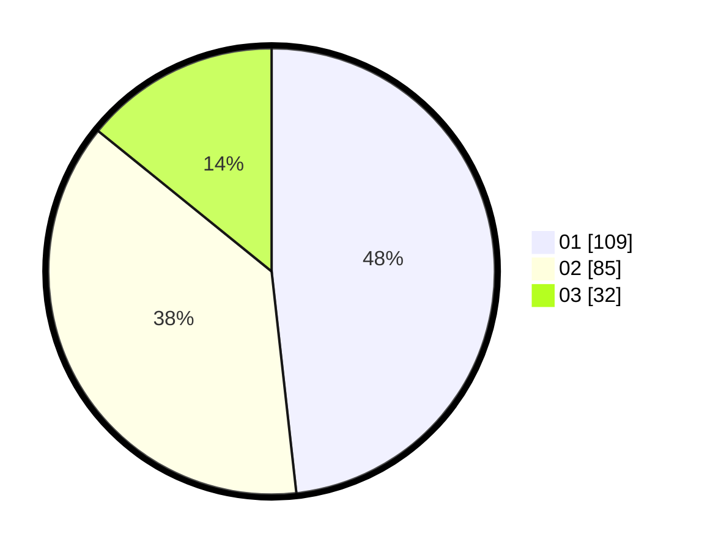

# Hasil

Hasil perolehan suara paslon dapat dilihat pada file paslon-01.txt, paslon-02.txt, dan paslon-03.txt.

Jika tidak ada, artinya data tersebut belum ada pada SIREKAP.

## Perolehan Suara

 * Paslon 01: **109**.
 * Paslon 02: **85**.
 * Paslon 03: **32**.

## Foto C Plano

https://sirekap-obj-formc.kpu.go.id/7fc6/pemilu/ppwp/31/71/03/10/06/3171031006024-20240217-103224--5b54bdc0-cbfb-459a-9440-122629add77c.jpg

https://sirekap-obj-formc.kpu.go.id/7fc6/pemilu/ppwp/31/71/03/10/06/3171031006024-20240217-103225--ee0cea5e-4666-4227-a93b-52e914a642be.jpg

https://sirekap-obj-formc.kpu.go.id/7fc6/pemilu/ppwp/31/71/03/10/06/3171031006024-20240217-103224--1b3e6c82-2134-47dd-ac8e-19a9fde63d3e.jpg

## DATA PEMILIH TETAP

Jumlah pemilih dalam DPT: **280**.
 * L: **133**.
 * P: **147**.

## DATA PENGGUNA HAK PILIH

Jumlah pengguna hak pilih dalam DPT: **227**.
 * L: **103**.
 * P: **124**.

Jumlah pengguna hak pilih dalam DPTb: **3**.
 * L: **1**.
 * P: **2**.

Jumlah pengguna hak pilih dalam DPK: **0**.
 * L: **0**.
 * P: **0**.

Jumlah pengguna hak pilih: **230**.
 * L: **104**.
 * P: **126**.

## JUMLAH SUARA SAH DAN TIDAK SAH

JUMLAH SELURUH SUARA SAH: **226**.

JUMLAH SUARA TIDAK SAH: **4**.

JUMLAH SELURUH SUARA SAH DAN SUARA TIDAK SAH: **230**.
