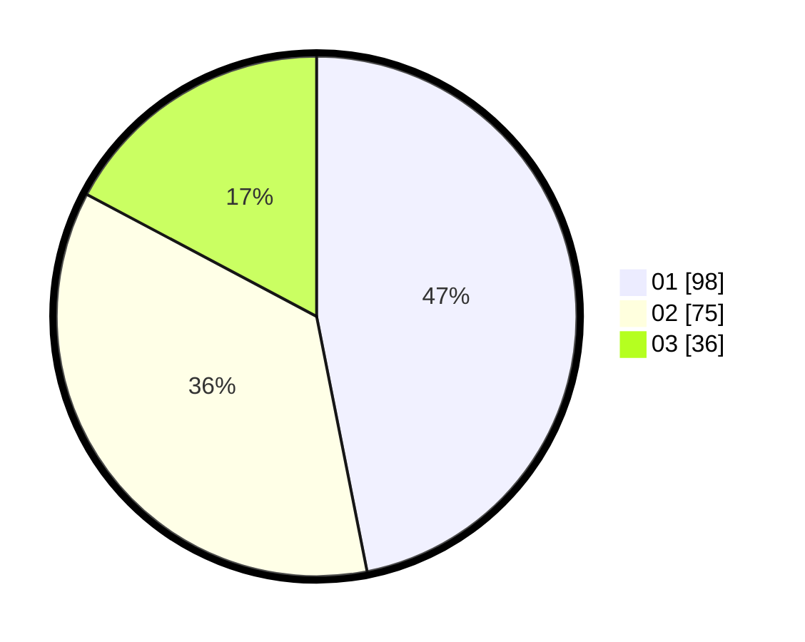

# Hasil

Hasil perolehan suara paslon dapat dilihat pada file paslon-01.txt, paslon-02.txt, dan paslon-03.txt.

Jika tidak ada, artinya data tersebut belum ada pada SIREKAP.

## Perolehan Suara

 * Paslon 01: **98**.
 * Paslon 02: **75**.
 * Paslon 03: **36**.

## Foto C Plano

https://sirekap-obj-formc.kpu.go.id/6311/pemilu/ppwp/31/71/03/10/06/3171031006025-20240214-235005--a328021d-ccd8-4037-bf5b-a222c8296812.jpg

https://sirekap-obj-formc.kpu.go.id/6311/pemilu/ppwp/31/71/03/10/06/3171031006025-20240214-235245--c28a56d8-4b67-47e0-8b84-540ab3b6d046.jpg

https://sirekap-obj-formc.kpu.go.id/6311/pemilu/ppwp/31/71/03/10/06/3171031006025-20240214-235521--674909e0-c593-40d1-b940-083323013a7b.jpg
