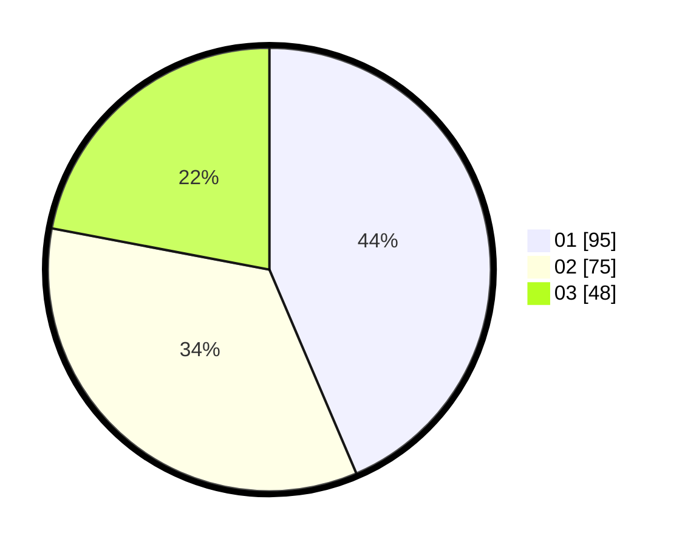

# Hasil

Hasil perolehan suara paslon dapat dilihat pada file paslon-01.txt, paslon-02.txt, dan paslon-03.txt.

Jika tidak ada, artinya data tersebut belum ada pada SIREKAP.

## Perolehan Suara

 * Paslon 01: **95**.
 * Paslon 02: **75**.
 * Paslon 03: **48**.

## Foto C Plano

https://sirekap-obj-formc.kpu.go.id/b13b/pemilu/ppwp/31/71/03/10/06/3171031006028-20240218-160408--e06ec0c3-7cd3-46e9-bde8-9b071d5d92ec.jpg

https://sirekap-obj-formc.kpu.go.id/b13b/pemilu/ppwp/31/71/03/10/06/3171031006028-20240216-175739--460a5355-6ffe-43e7-9625-fd75ddb111a5.jpg

https://sirekap-obj-formc.kpu.go.id/b13b/pemilu/ppwp/31/71/03/10/06/3171031006028-20240218-160409--98c58f5d-1e30-4db4-8995-e99b9e4a70c2.jpg

## DATA PEMILIH TETAP

Jumlah pemilih dalam DPT: **268**.
 * L: **136**.
 * P: **132**.

## DATA PENGGUNA HAK PILIH

Jumlah pengguna hak pilih dalam DPT: **213**.
 * L: **105**.
 * P: **108**.

Jumlah pengguna hak pilih dalam DPTb: **9**.
 * L: **1**.
 * P: **8**.

Jumlah pengguna hak pilih dalam DPK: **3**.
 * L: **2**.
 * P: **1**.

Jumlah pengguna hak pilih: **225**.
 * L: **108**.
 * P: **117**.

## JUMLAH SUARA SAH DAN TIDAK SAH

JUMLAH SELURUH SUARA SAH: **219**.

JUMLAH SUARA TIDAK SAH: **6**.

JUMLAH SELURUH SUARA SAH DAN SUARA TIDAK SAH: **225**.
