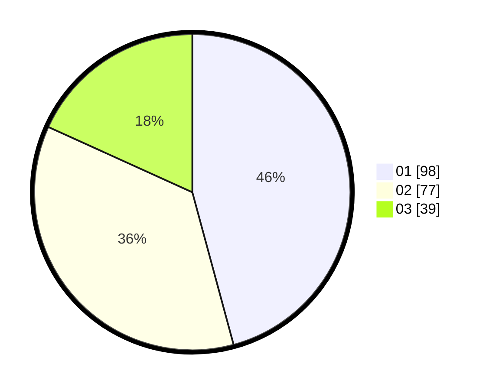

# Hasil

Hasil perolehan suara paslon dapat dilihat pada file paslon-01.txt, paslon-02.txt, dan paslon-03.txt.

Jika tidak ada, artinya data tersebut belum ada pada SIREKAP.

## Perolehan Suara

 * Paslon 01: **98**.
 * Paslon 02: **77**.
 * Paslon 03: **39**.

## Foto C Plano

https://sirekap-obj-formc.kpu.go.id/52b0/pemilu/ppwp/31/71/03/10/06/3171031006030-20240216-191627--a3e5e5f6-b012-4df3-9f56-40bfc57ca96f.jpg

https://sirekap-obj-formc.kpu.go.id/52b0/pemilu/ppwp/31/71/03/10/06/3171031006030-20240214-235858--e0b9ba25-1452-490a-b98e-240c2828b39d.jpg

https://sirekap-obj-formc.kpu.go.id/52b0/pemilu/ppwp/31/71/03/10/06/3171031006030-20240215-000124--0773e68d-89c9-40fa-99c9-5a85e297606a.jpg

## DATA PEMILIH TETAP

Jumlah pemilih dalam DPT: **272**.
 * L: **120**.
 * P: **152**.

## DATA PENGGUNA HAK PILIH

Jumlah pengguna hak pilih dalam DPT: **210**.
 * L: **88**.
 * P: **122**.

Jumlah pengguna hak pilih dalam DPTb: **4**.
 * L: **1**.
 * P: **3**.

Jumlah pengguna hak pilih dalam DPK: **1**.
 * L: **0**.
 * P: **1**.

Jumlah pengguna hak pilih: **215**.
 * L: **89**.
 * P: **126**.

## JUMLAH SUARA SAH DAN TIDAK SAH

JUMLAH SELURUH SUARA SAH: **214**.

JUMLAH SUARA TIDAK SAH: **1**.

JUMLAH SELURUH SUARA SAH DAN SUARA TIDAK SAH: **215**.
