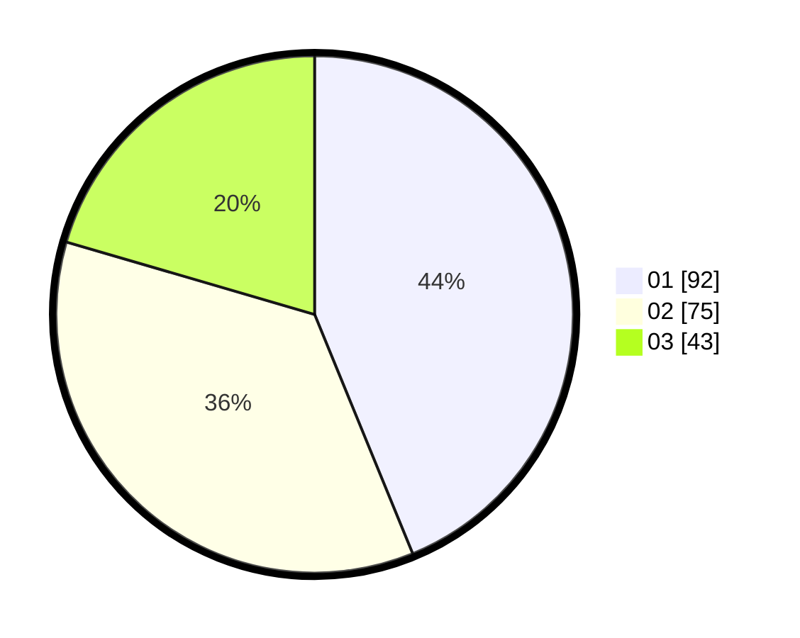

# Hasil

Hasil perolehan suara paslon dapat dilihat pada file paslon-01.txt, paslon-02.txt, dan paslon-03.txt.

Jika tidak ada, artinya data tersebut belum ada pada SIREKAP.

## Perolehan Suara

 * Paslon 01: **92**.
 * Paslon 02: **75**.
 * Paslon 03: **43**.

## Foto C Plano

https://sirekap-obj-formc.kpu.go.id/721f/pemilu/ppwp/31/71/03/10/06/3171031006032-20240217-145149--6433161c-ec13-4655-94cd-03edf9cda487.jpg

https://sirekap-obj-formc.kpu.go.id/721f/pemilu/ppwp/31/71/03/10/06/3171031006032-20240217-145443--38cb1d6a-d780-40f5-86bd-95ee23d441ec.jpg

https://sirekap-obj-formc.kpu.go.id/721f/pemilu/ppwp/31/71/03/10/06/3171031006032-20240217-152810--284e3111-f851-4aef-95ce-54e61d47b97a.jpg
