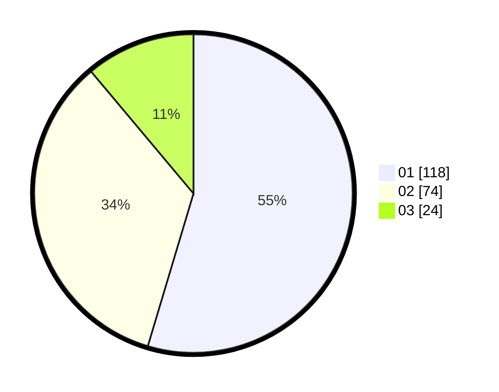

# Hasil

Hasil perolehan suara paslon dapat dilihat pada file paslon-01.txt, paslon-02.txt, dan paslon-03.txt.

Jika tidak ada, artinya data tersebut belum ada pada SIREKAP.

## Perolehan Suara

 * Paslon 01: **118**.
 * Paslon 02: **74**.
 * Paslon 03: **24**.

## Foto C Plano

https://sirekap-obj-formc.kpu.go.id/0cd3/pemilu/ppwp/31/71/03/10/06/3171031006038-20240216-151922--77767700-f37d-4558-a4ac-90a8b0b2172a.jpg

https://sirekap-obj-formc.kpu.go.id/0cd3/pemilu/ppwp/31/71/03/10/06/3171031006038-20240216-151924--b015cb89-5b7f-4f02-bfa8-19ea1c9771d9.jpg

https://sirekap-obj-formc.kpu.go.id/0cd3/pemilu/ppwp/31/71/03/10/06/3171031006038-20240216-151923--5fa04989-5b0e-4c1e-9ad4-404c0ef62833.jpg

## DATA PEMILIH TETAP

Jumlah pemilih dalam DPT: **276**.
 * L: **133**.
 * P: **143**.

## DATA PENGGUNA HAK PILIH

Jumlah pengguna hak pilih dalam DPT: **218**.
 * L: **104**.
 * P: **114**.

Jumlah pengguna hak pilih dalam DPTb: **0**.
 * L: **0**.
 * P: **0**.

Jumlah pengguna hak pilih dalam DPK: **0**.
 * L: **0**.
 * P: **0**.

Jumlah pengguna hak pilih: **218**.
 * L: **104**.
 * P: **114**.

## JUMLAH SUARA SAH DAN TIDAK SAH

JUMLAH SELURUH SUARA SAH: **216**.

JUMLAH SUARA TIDAK SAH: **2**.

JUMLAH SELURUH SUARA SAH DAN SUARA TIDAK SAH: **218**.
