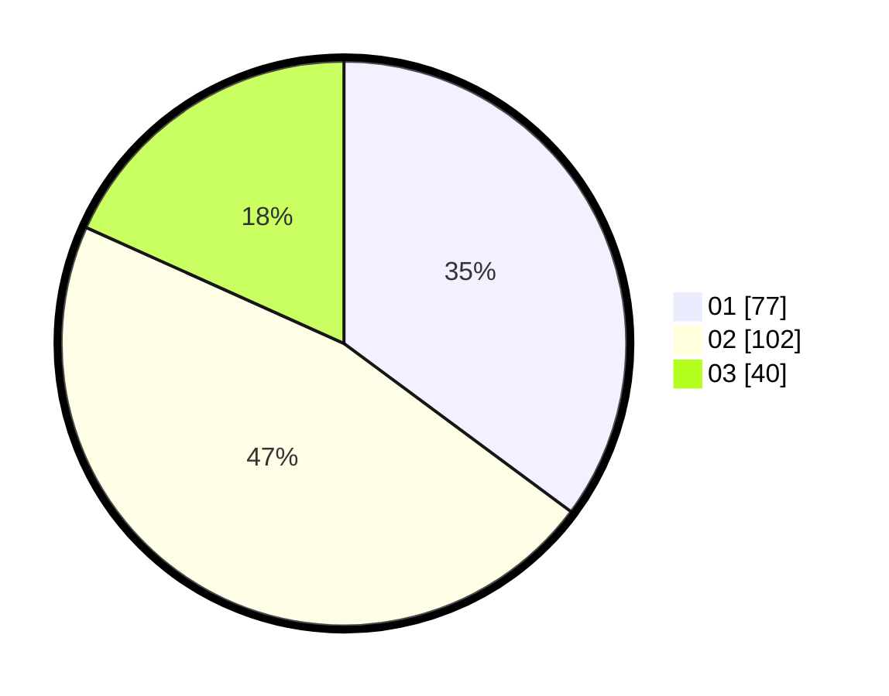

# Hasil

Hasil perolehan suara paslon dapat dilihat pada file paslon-01.txt, paslon-02.txt, dan paslon-03.txt.

Jika tidak ada, artinya data tersebut belum ada pada SIREKAP.

## Perolehan Suara

 * Paslon 01: **77**.
 * Paslon 02: **102**.
 * Paslon 03: **40**.

## Foto C Plano

https://sirekap-obj-formc.kpu.go.id/d3dc/pemilu/ppwp/31/71/03/10/06/3171031006039-20240214-230325--925698d0-d997-47b7-9918-07b2e71ff23a.jpg

https://sirekap-obj-formc.kpu.go.id/d3dc/pemilu/ppwp/31/71/03/10/06/3171031006039-20240214-230602--1ebce2a5-e5e5-4855-ae95-4a0a23d69601.jpg

https://sirekap-obj-formc.kpu.go.id/d3dc/pemilu/ppwp/31/71/03/10/06/3171031006039-20240214-231359--61325802-29ab-4382-9cc0-d3408a2b2af3.jpg

## DATA PEMILIH TETAP

Jumlah pemilih dalam DPT: **282**.
 * L: **145**.
 * P: **137**.

## DATA PENGGUNA HAK PILIH

Jumlah pengguna hak pilih dalam DPT: **209**.
 * L: **103**.
 * P: **105**.

Jumlah pengguna hak pilih dalam DPTb: **10**.
 * L: **5**.
 * P: **5**.

Jumlah pengguna hak pilih dalam DPK: **3**.
 * L: **2**.
 * P: **1**.

Jumlah pengguna hak pilih: **222**.
 * L: **110**.
 * P: **113**.

## JUMLAH SUARA SAH DAN TIDAK SAH

JUMLAH SELURUH SUARA SAH: **218**.

JUMLAH SUARA TIDAK SAH: **4**.

JUMLAH SELURUH SUARA SAH DAN SUARA TIDAK SAH: **222**.
