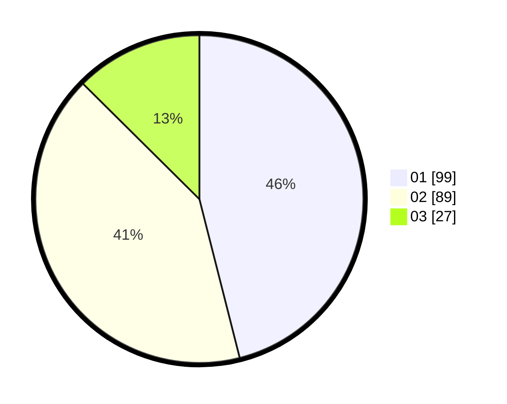

# Hasil

Hasil perolehan suara paslon dapat dilihat pada file paslon-01.txt, paslon-02.txt, dan paslon-03.txt.

Jika tidak ada, artinya data tersebut belum ada pada SIREKAP.

## Perolehan Suara

 * Paslon 01: **99**.
 * Paslon 02: **89**.
 * Paslon 03: **27**.

## Foto C Plano

https://sirekap-obj-formc.kpu.go.id/4358/pemilu/ppwp/31/71/03/10/06/3171031006040-20240216-133404--453e66cc-bb26-4163-b27c-a464bf800055.jpg

https://sirekap-obj-formc.kpu.go.id/4358/pemilu/ppwp/31/71/03/10/06/3171031006040-20240216-133405--57487279-8f9c-47cc-baad-a252393c3537.jpg

https://sirekap-obj-formc.kpu.go.id/4358/pemilu/ppwp/31/71/03/10/06/3171031006040-20240216-133404--785232d7-5e3a-494e-b4ee-a19d17193906.jpg

## DATA PEMILIH TETAP

Jumlah pemilih dalam DPT: **281**.
 * L: **141**.
 * P: **140**.

## DATA PENGGUNA HAK PILIH

Jumlah pengguna hak pilih dalam DPT: **211**.
 * L: **105**.
 * P: **106**.

Jumlah pengguna hak pilih dalam DPTb: **6**.
 * L: **5**.
 * P: **1**.

Jumlah pengguna hak pilih dalam DPK: **0**.
 * L: **0**.
 * P: **0**.

Jumlah pengguna hak pilih: **217**.
 * L: **110**.
 * P: **107**.

## JUMLAH SUARA SAH DAN TIDAK SAH

JUMLAH SELURUH SUARA SAH: **215**.

JUMLAH SUARA TIDAK SAH: **2**.

JUMLAH SELURUH SUARA SAH DAN SUARA TIDAK SAH: **217**.
