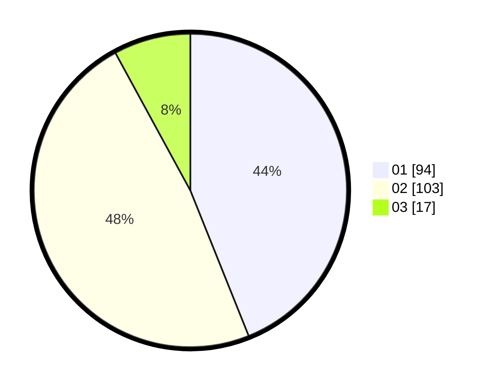

# Hasil

Hasil perolehan suara paslon dapat dilihat pada file paslon-01.txt, paslon-02.txt, dan paslon-03.txt.

Jika tidak ada, artinya data tersebut belum ada pada SIREKAP.

## Perolehan Suara

 * Paslon 01: **94**.
 * Paslon 02: **103**.
 * Paslon 03: **17**.

## Foto C Plano

https://sirekap-obj-formc.kpu.go.id/a272/pemilu/ppwp/31/71/03/10/06/3171031006046-20240216-084118--c0ad1f0c-133d-49b3-84b2-e1fc191112d3.jpg

https://sirekap-obj-formc.kpu.go.id/a272/pemilu/ppwp/31/71/03/10/06/3171031006046-20240216-084120--88a775e4-0be1-47e6-9770-cdcf8452523d.jpg

https://sirekap-obj-formc.kpu.go.id/a272/pemilu/ppwp/31/71/03/10/06/3171031006046-20240216-084119--ddbf32fd-f08a-4cc6-a1f5-0acc6b57a10c.jpg

## DATA PEMILIH TETAP

Jumlah pemilih dalam DPT: **291**.
 * L: **136**.
 * P: **155**.

## DATA PENGGUNA HAK PILIH

Jumlah pengguna hak pilih dalam DPT: **212**.
 * L: **96**.
 * P: **116**.

Jumlah pengguna hak pilih dalam DPTb: **4**.
 * L: **1**.
 * P: **3**.

Jumlah pengguna hak pilih dalam DPK: **2**.
 * L: **1**.
 * P: **1**.

Jumlah pengguna hak pilih: **218**.
 * L: **98**.
 * P: **120**.

## JUMLAH SUARA SAH DAN TIDAK SAH

JUMLAH SELURUH SUARA SAH: **214**.

JUMLAH SUARA TIDAK SAH: **4**.

JUMLAH SELURUH SUARA SAH DAN SUARA TIDAK SAH: **218**.
