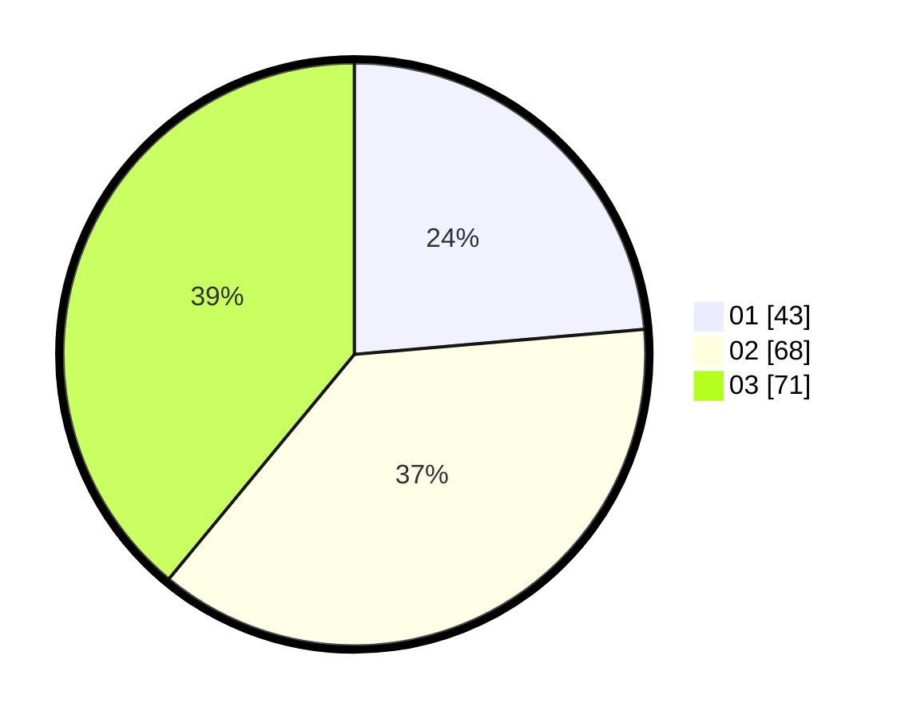

# Hasil

Hasil perolehan suara paslon dapat dilihat pada file paslon-01.txt, paslon-02.txt, dan paslon-03.txt.

Jika tidak ada, artinya data tersebut belum ada pada SIREKAP.

## Perolehan Suara

 * Paslon 01: **43**.
 * Paslon 02: **68**.
 * Paslon 03: **71**.

## Foto C Plano

https://sirekap-obj-formc.kpu.go.id/4e75/pemilu/ppwp/31/71/03/10/06/3171031006050-20240216-132913--7111bf8e-b23b-4df9-82c9-9c05bc5d3edf.jpg

https://sirekap-obj-formc.kpu.go.id/4e75/pemilu/ppwp/31/71/03/10/06/3171031006050-20240216-132914--d56d0a87-b098-4109-b243-d85e9fab55b9.jpg

https://sirekap-obj-formc.kpu.go.id/4e75/pemilu/ppwp/31/71/03/10/06/3171031006050-20240216-132913--c62581d1-237f-4ebb-85f7-4af6f37e6a09.jpg

## DATA PEMILIH TETAP

Jumlah pemilih dalam DPT: **178**.
 * L: **76**.
 * P: **102**.

## DATA PENGGUNA HAK PILIH

Jumlah pengguna hak pilih dalam DPT: **178**.
 * L: **76**.
 * P: **102**.

Jumlah pengguna hak pilih dalam DPTb: **2**.
 * L: **0**.
 * P: **2**.

Jumlah pengguna hak pilih dalam DPK: **3**.
 * L: **1**.
 * P: **2**.

Jumlah pengguna hak pilih: **183**.
 * L: **77**.
 * P: **106**.

## JUMLAH SUARA SAH DAN TIDAK SAH

JUMLAH SELURUH SUARA SAH: **182**.

JUMLAH SUARA TIDAK SAH: **1**.

JUMLAH SELURUH SUARA SAH DAN SUARA TIDAK SAH: **183**.
