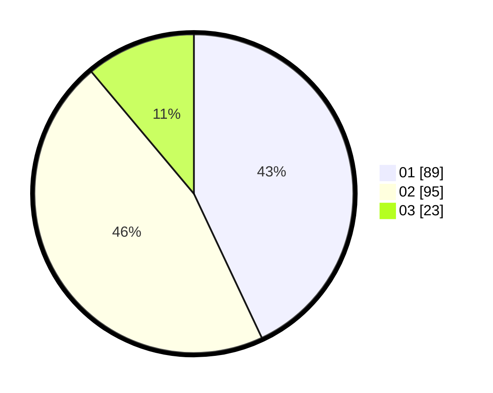

# Hasil

Hasil perolehan suara paslon dapat dilihat pada file paslon-01.txt, paslon-02.txt, dan paslon-03.txt.

Jika tidak ada, artinya data tersebut belum ada pada SIREKAP.

## Perolehan Suara

 * Paslon 01: **89**.
 * Paslon 02: **95**.
 * Paslon 03: **23**.

## Foto C Plano

https://sirekap-obj-formc.kpu.go.id/a24b/pemilu/ppwp/31/71/03/10/06/3171031006052-20240216-211231--0343eaf9-2edb-4496-bee6-02ee5bdcb950.jpg

https://sirekap-obj-formc.kpu.go.id/a24b/pemilu/ppwp/31/71/03/10/06/3171031006052-20240216-211233--456492d2-1447-45f4-b441-538194941221.jpg

https://sirekap-obj-formc.kpu.go.id/a24b/pemilu/ppwp/31/71/03/10/06/3171031006052-20240216-211232--002bf528-08e8-4087-af6d-15f8cc053605.jpg

## DATA PEMILIH TETAP

Jumlah pemilih dalam DPT: **269**.
 * L: **137**.
 * P: **132**.

## DATA PENGGUNA HAK PILIH

Jumlah pengguna hak pilih dalam DPT: **205**.
 * L: **98**.
 * P: **107**.

Jumlah pengguna hak pilih dalam DPTb: **6**.
 * L: **5**.
 * P: **1**.

Jumlah pengguna hak pilih dalam DPK: **0**.
 * L: **0**.
 * P: **0**.

Jumlah pengguna hak pilih: **211**.
 * L: **103**.
 * P: **108**.

## JUMLAH SUARA SAH DAN TIDAK SAH

JUMLAH SELURUH SUARA SAH: **207**.

JUMLAH SUARA TIDAK SAH: **4**.

JUMLAH SELURUH SUARA SAH DAN SUARA TIDAK SAH: **211**.
