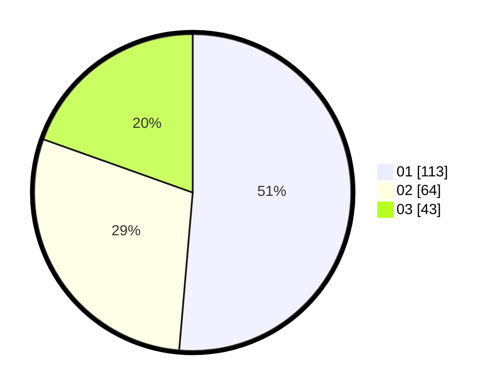

# Hasil

Hasil perolehan suara paslon dapat dilihat pada file paslon-01.txt, paslon-02.txt, dan paslon-03.txt.

Jika tidak ada, artinya data tersebut belum ada pada SIREKAP.

## Perolehan Suara

 * Paslon 01: **113**.
 * Paslon 02: **64**.
 * Paslon 03: **43**.

## Foto C Plano

https://sirekap-obj-formc.kpu.go.id/187e/pemilu/ppwp/31/71/03/10/06/3171031006053-20240215-032547--1ac743dd-1ae4-4971-a24a-5f2c800b1e2d.jpg

https://sirekap-obj-formc.kpu.go.id/187e/pemilu/ppwp/31/71/03/10/06/3171031006053-20240215-032617--bdb02cdb-b89a-414b-9cf9-1b8791b9c578.jpg

https://sirekap-obj-formc.kpu.go.id/187e/pemilu/ppwp/31/71/03/10/06/3171031006053-20240215-032606--ec28a8af-cdd8-448a-adac-45a4dc24912d.jpg

## DATA PEMILIH TETAP

Jumlah pemilih dalam DPT: **278**.
 * L: **132**.
 * P: **146**.

## DATA PENGGUNA HAK PILIH

Jumlah pengguna hak pilih dalam DPT: **220**.
 * L: **103**.
 * P: **117**.

Jumlah pengguna hak pilih dalam DPTb: **2**.
 * L: **1**.
 * P: **1**.

Jumlah pengguna hak pilih dalam DPK: **3**.
 * L: **2**.
 * P: **1**.

Jumlah pengguna hak pilih: **225**.
 * L: **106**.
 * P: **119**.

## JUMLAH SUARA SAH DAN TIDAK SAH

JUMLAH SELURUH SUARA SAH: **220**.

JUMLAH SUARA TIDAK SAH: **5**.

JUMLAH SELURUH SUARA SAH DAN SUARA TIDAK SAH: **225**.
