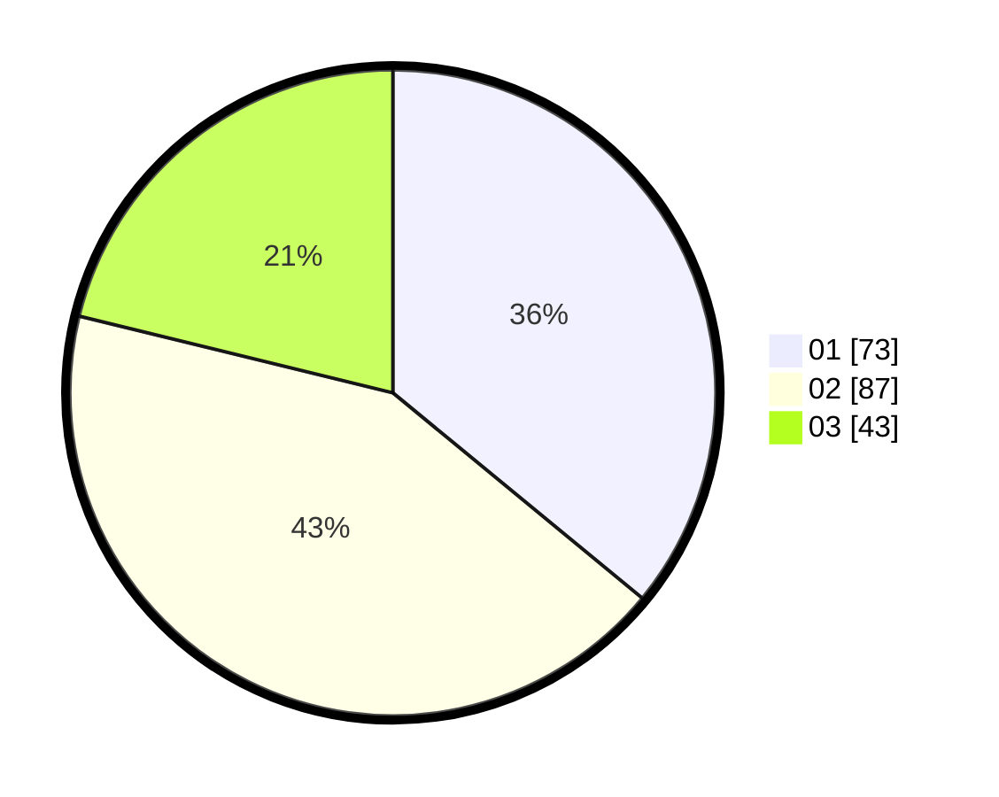

# Hasil

Hasil perolehan suara paslon dapat dilihat pada file paslon-01.txt, paslon-02.txt, dan paslon-03.txt.

Jika tidak ada, artinya data tersebut belum ada pada SIREKAP.

## Perolehan Suara

 * Paslon 01: **73**.
 * Paslon 02: **87**.
 * Paslon 03: **43**.

## Foto C Plano

https://sirekap-obj-formc.kpu.go.id/5c3b/pemilu/ppwp/31/71/03/10/06/3171031006054-20240214-220929--d984228e-fa89-41b9-bc45-aef12d5e50ed.jpg

https://sirekap-obj-formc.kpu.go.id/5c3b/pemilu/ppwp/31/71/03/10/06/3171031006054-20240214-220934--2ab833b4-ea99-49cf-b2af-41a09626aa9d.jpg

https://sirekap-obj-formc.kpu.go.id/5c3b/pemilu/ppwp/31/71/03/10/06/3171031006054-20240214-220938--fbebbe5a-feaf-4c11-b85b-8ba255806126.jpg

## DATA PEMILIH TETAP

Jumlah pemilih dalam DPT: **266**.
 * L: **137**.
 * P: **129**.

## DATA PENGGUNA HAK PILIH

Jumlah pengguna hak pilih dalam DPT: **201**.
 * L: **98**.
 * P: **103**.

Jumlah pengguna hak pilih dalam DPTb: **6**.
 * L: **3**.
 * P: **3**.

Jumlah pengguna hak pilih dalam DPK: **2**.
 * L: **1**.
 * P: **1**.

Jumlah pengguna hak pilih: **209**.
 * L: **102**.
 * P: **107**.

## JUMLAH SUARA SAH DAN TIDAK SAH

JUMLAH SELURUH SUARA SAH: **203**.

JUMLAH SUARA TIDAK SAH: **6**.

JUMLAH SELURUH SUARA SAH DAN SUARA TIDAK SAH: **209**.
