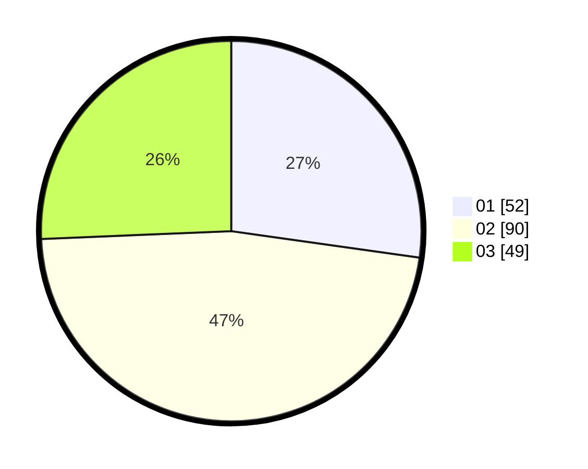

# Hasil

Hasil perolehan suara paslon dapat dilihat pada file paslon-01.txt, paslon-02.txt, dan paslon-03.txt.

Jika tidak ada, artinya data tersebut belum ada pada SIREKAP.

## Perolehan Suara

 * Paslon 01: **52**.
 * Paslon 02: **90**.
 * Paslon 03: **49**.

## Foto C Plano

https://sirekap-obj-formc.kpu.go.id/e647/pemilu/ppwp/31/71/03/10/06/3171031006055-20240216-150858--a214bd23-9fa4-4a3d-9b38-dfc94f6db7e6.jpg

https://sirekap-obj-formc.kpu.go.id/e647/pemilu/ppwp/31/71/03/10/06/3171031006055-20240216-150859--76b759e8-b7b5-430c-8d41-a4d03f56d265.jpg

https://sirekap-obj-formc.kpu.go.id/e647/pemilu/ppwp/31/71/03/10/06/3171031006055-20240216-150858--76309ac4-ad55-4127-b203-a006464dca7f.jpg

## DATA PEMILIH TETAP

Jumlah pemilih dalam DPT: **274**.
 * L: **142**.
 * P: **132**.

## DATA PENGGUNA HAK PILIH

Jumlah pengguna hak pilih dalam DPT: **192**.
 * L: **99**.
 * P: **93**.

Jumlah pengguna hak pilih dalam DPTb: **1**.
 * L: **0**.
 * P: **1**.

Jumlah pengguna hak pilih dalam DPK: **1**.
 * L: **1**.
 * P: **0**.

Jumlah pengguna hak pilih: **194**.
 * L: **100**.
 * P: **94**.

## JUMLAH SUARA SAH DAN TIDAK SAH

JUMLAH SELURUH SUARA SAH: **191**.

JUMLAH SUARA TIDAK SAH: **3**.

JUMLAH SELURUH SUARA SAH DAN SUARA TIDAK SAH: **194**.
