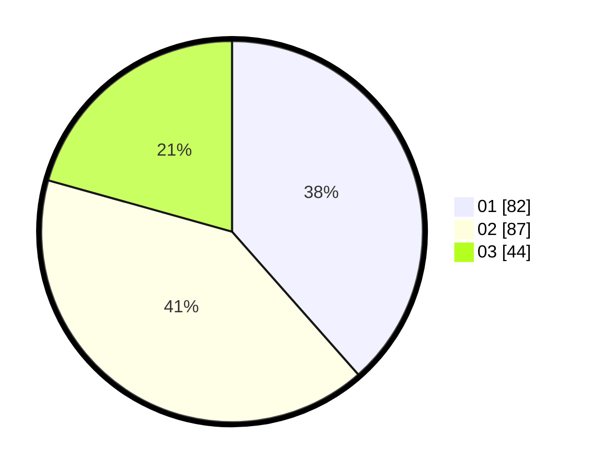

# Hasil

Hasil perolehan suara paslon dapat dilihat pada file paslon-01.txt, paslon-02.txt, dan paslon-03.txt.

Jika tidak ada, artinya data tersebut belum ada pada SIREKAP.

## Perolehan Suara

 * Paslon 01: **82**.
 * Paslon 02: **87**.
 * Paslon 03: **44**.

## Foto C Plano

https://sirekap-obj-formc.kpu.go.id/c91e/pemilu/ppwp/31/71/03/10/06/3171031006056-20240216-010957--007effe5-9736-4f3e-ae66-656478449517.jpg

https://sirekap-obj-formc.kpu.go.id/c91e/pemilu/ppwp/31/71/03/10/06/3171031006056-20240216-011005--80d02457-90ce-4550-8c11-982e59f5144f.jpg

https://sirekap-obj-formc.kpu.go.id/c91e/pemilu/ppwp/31/71/03/10/06/3171031006056-20240216-011000--59b59aab-f33c-4a7a-ae93-f804db1b93ef.jpg

## DATA PEMILIH TETAP

Jumlah pemilih dalam DPT: **280**.
 * L: **138**.
 * P: **142**.

## DATA PENGGUNA HAK PILIH

Jumlah pengguna hak pilih dalam DPT: **215**.
 * L: **103**.
 * P: **112**.

Jumlah pengguna hak pilih dalam DPTb: **1**.
 * L: **1**.
 * P: **0**.

Jumlah pengguna hak pilih dalam DPK: **1**.
 * L: **0**.
 * P: **1**.

Jumlah pengguna hak pilih: **217**.
 * L: **104**.
 * P: **113**.

## JUMLAH SUARA SAH DAN TIDAK SAH

JUMLAH SELURUH SUARA SAH: **213**.

JUMLAH SUARA TIDAK SAH: **4**.

JUMLAH SELURUH SUARA SAH DAN SUARA TIDAK SAH: **217**.
