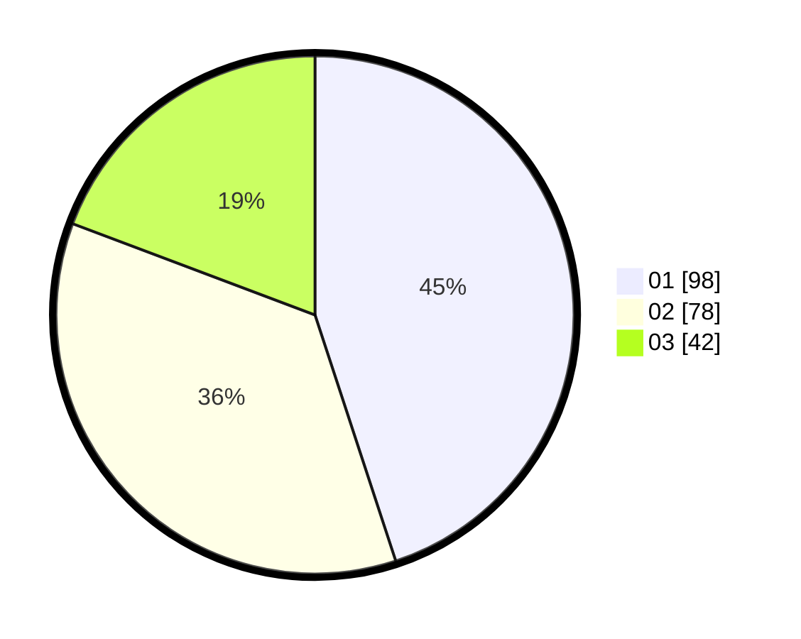

# Hasil

Hasil perolehan suara paslon dapat dilihat pada file paslon-01.txt, paslon-02.txt, dan paslon-03.txt.

Jika tidak ada, artinya data tersebut belum ada pada SIREKAP.

## Perolehan Suara

 * Paslon 01: **98**.
 * Paslon 02: **78**.
 * Paslon 03: **42**.

## Foto C Plano

https://sirekap-obj-formc.kpu.go.id/b1be/pemilu/ppwp/31/71/03/10/06/3171031006057-20240215-225912--cb2d5b03-b09f-449f-aa0a-0aff2c980df6.jpg

https://sirekap-obj-formc.kpu.go.id/b1be/pemilu/ppwp/31/71/03/10/06/3171031006057-20240215-225914--51198085-3d53-4a65-a53e-31c4df9f9ec6.jpg

https://sirekap-obj-formc.kpu.go.id/b1be/pemilu/ppwp/31/71/03/10/06/3171031006057-20240215-225912--94fa3b04-3741-4d4f-b1d4-26435bcb0e9d.jpg

## DATA PEMILIH TETAP

Jumlah pemilih dalam DPT: **271**.
 * L: **131**.
 * P: **140**.

## DATA PENGGUNA HAK PILIH

Jumlah pengguna hak pilih dalam DPT: **217**.
 * L: **100**.
 * P: **117**.

Jumlah pengguna hak pilih dalam DPTb: **4**.
 * L: **0**.
 * P: **4**.

Jumlah pengguna hak pilih dalam DPK: **1**.
 * L: **0**.
 * P: **1**.

Jumlah pengguna hak pilih: **222**.
 * L: **100**.
 * P: **122**.

## JUMLAH SUARA SAH DAN TIDAK SAH

JUMLAH SELURUH SUARA SAH: **218**.

JUMLAH SUARA TIDAK SAH: **4**.

JUMLAH SELURUH SUARA SAH DAN SUARA TIDAK SAH: **222**.
