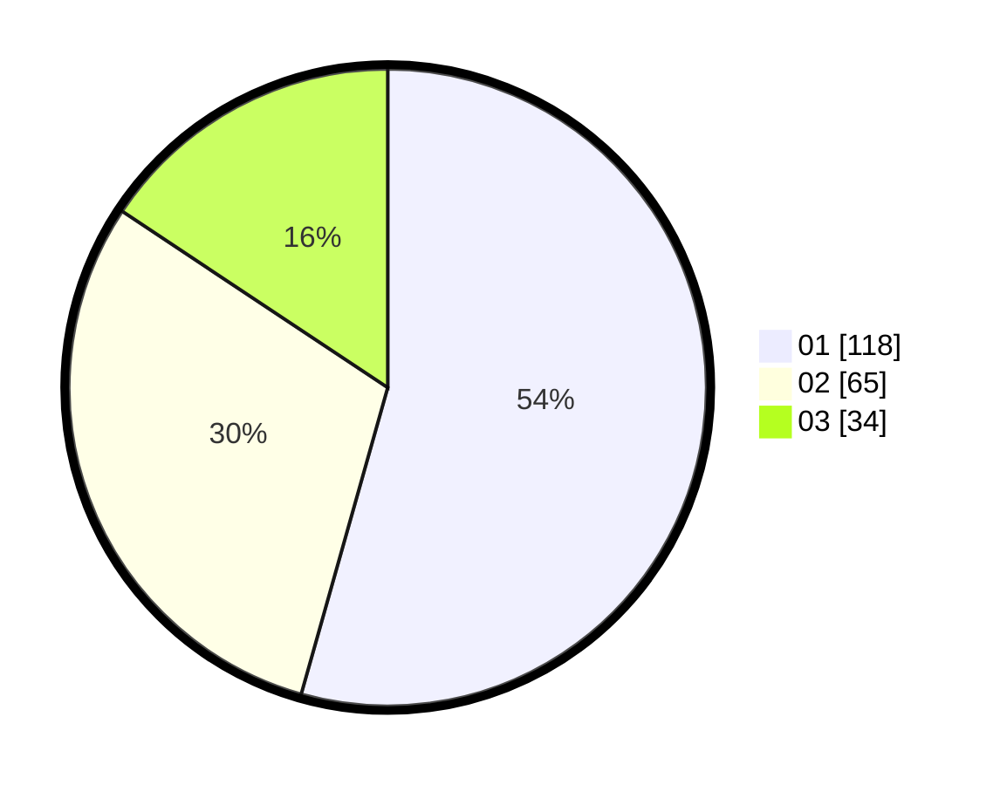

# Hasil

Hasil perolehan suara paslon dapat dilihat pada file paslon-01.txt, paslon-02.txt, dan paslon-03.txt.

Jika tidak ada, artinya data tersebut belum ada pada SIREKAP.

## Perolehan Suara

 * Paslon 01: **118**.
 * Paslon 02: **65**.
 * Paslon 03: **34**.

## Foto C Plano

https://sirekap-obj-formc.kpu.go.id/16e5/pemilu/ppwp/31/71/03/10/06/3171031006058-20240216-122321--a05ad110-adbe-4ece-ba33-a5f2943e51b5.jpg

https://sirekap-obj-formc.kpu.go.id/16e5/pemilu/ppwp/31/71/03/10/06/3171031006058-20240216-122322--faabafdb-92ac-4211-9e65-31b4dbcebf79.jpg

https://sirekap-obj-formc.kpu.go.id/16e5/pemilu/ppwp/31/71/03/10/06/3171031006058-20240216-122322--37fd3e75-0421-4e85-9c24-9a0248988ce0.jpg

## DATA PEMILIH TETAP

Jumlah pemilih dalam DPT: **214**.
 * L: **99**.
 * P: **115**.

## DATA PENGGUNA HAK PILIH

Jumlah pengguna hak pilih dalam DPT: **214**.
 * L: **99**.
 * P: **115**.

Jumlah pengguna hak pilih dalam DPTb: **3**.
 * L: **1**.
 * P: **2**.

Jumlah pengguna hak pilih dalam DPK: **1**.
 * L: **0**.
 * P: **1**.

Jumlah pengguna hak pilih: **218**.
 * L: **100**.
 * P: **118**.

## JUMLAH SUARA SAH DAN TIDAK SAH

JUMLAH SELURUH SUARA SAH: **217**.

JUMLAH SUARA TIDAK SAH: **1**.

JUMLAH SELURUH SUARA SAH DAN SUARA TIDAK SAH: **218**.
