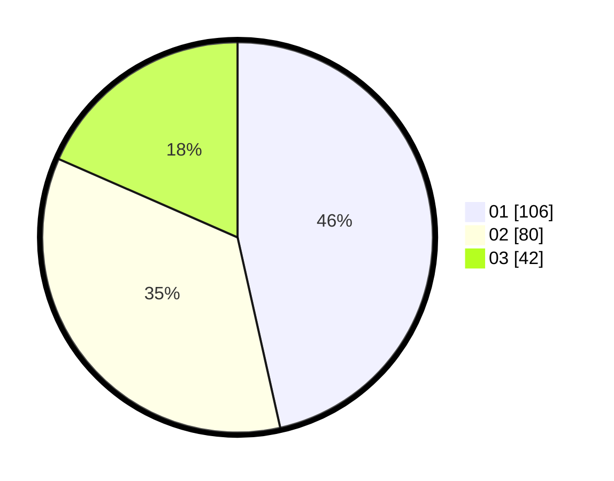

# Hasil

Hasil perolehan suara paslon dapat dilihat pada file paslon-01.txt, paslon-02.txt, dan paslon-03.txt.

Jika tidak ada, artinya data tersebut belum ada pada SIREKAP.

## Perolehan Suara

 * Paslon 01: **106**.
 * Paslon 02: **80**.
 * Paslon 03: **42**.

## Foto C Plano

https://sirekap-obj-formc.kpu.go.id/0c0a/pemilu/ppwp/31/71/03/10/06/3171031006059-20240216-151846--8fd9aa1c-1faf-4dcd-a2b9-58a0c4ae8933.jpg

https://sirekap-obj-formc.kpu.go.id/0c0a/pemilu/ppwp/31/71/03/10/06/3171031006059-20240216-151847--26bb45de-3f67-46a2-ba2d-5977bfebc408.jpg

https://sirekap-obj-formc.kpu.go.id/0c0a/pemilu/ppwp/31/71/03/10/06/3171031006059-20240216-151846--515c62be-c1c8-421b-bd2e-a128b715e9e3.jpg

## DATA PEMILIH TETAP

Jumlah pemilih dalam DPT: **273**.
 * L: **130**.
 * P: **143**.

## DATA PENGGUNA HAK PILIH

Jumlah pengguna hak pilih dalam DPT: **224**.
 * L: **110**.
 * P: **114**.

Jumlah pengguna hak pilih dalam DPTb: **3**.
 * L: **0**.
 * P: **3**.

Jumlah pengguna hak pilih dalam DPK: **4**.
 * L: **3**.
 * P: **1**.

Jumlah pengguna hak pilih: **231**.
 * L: **113**.
 * P: **118**.

## JUMLAH SUARA SAH DAN TIDAK SAH

JUMLAH SELURUH SUARA SAH: **228**.

JUMLAH SUARA TIDAK SAH: **3**.

JUMLAH SELURUH SUARA SAH DAN SUARA TIDAK SAH: **231**.
