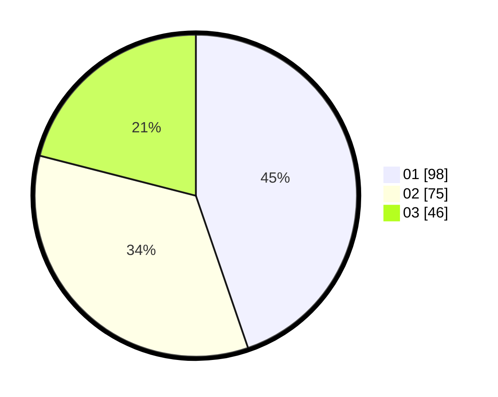

# Hasil

Hasil perolehan suara paslon dapat dilihat pada file paslon-01.txt, paslon-02.txt, dan paslon-03.txt.

Jika tidak ada, artinya data tersebut belum ada pada SIREKAP.

## Perolehan Suara

 * Paslon 01: **98**.
 * Paslon 02: **75**.
 * Paslon 03: **46**.

## Foto C Plano

https://sirekap-obj-formc.kpu.go.id/740f/pemilu/ppwp/31/71/03/10/06/3171031006063-20240215-213108--010e1b78-4d2c-4bd9-9cf6-bb508704d892.jpg

https://sirekap-obj-formc.kpu.go.id/740f/pemilu/ppwp/31/71/03/10/06/3171031006063-20240214-201838--6b0ba4f9-9bdb-48e8-a63c-88762e2ff1f8.jpg

https://sirekap-obj-formc.kpu.go.id/740f/pemilu/ppwp/31/71/03/10/06/3171031006063-20240214-195730--3f1b7624-16f4-4723-89d6-0c4e93bde899.jpg

## DATA PEMILIH TETAP

Jumlah pemilih dalam DPT: **0**.
 * L: **0**.
 * P: **0**.

## DATA PENGGUNA HAK PILIH

Jumlah pengguna hak pilih dalam DPT: **0**.
 * L: **0**.
 * P: **0**.

Jumlah pengguna hak pilih dalam DPTb: **0**.
 * L: **0**.
 * P: **0**.

Jumlah pengguna hak pilih dalam DPK: **0**.
 * L: **0**.
 * P: **0**.

Jumlah pengguna hak pilih: **0**.
 * L: **0**.
 * P: **0**.

## JUMLAH SUARA SAH DAN TIDAK SAH

JUMLAH SELURUH SUARA SAH: **219**.

JUMLAH SUARA TIDAK SAH: **1**.

JUMLAH SELURUH SUARA SAH DAN SUARA TIDAK SAH: **220**.
