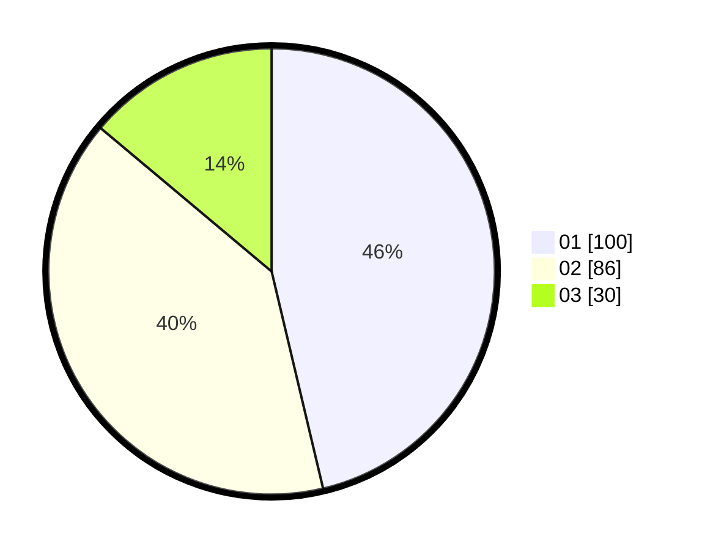

# Hasil

Hasil perolehan suara paslon dapat dilihat pada file paslon-01.txt, paslon-02.txt, dan paslon-03.txt.

Jika tidak ada, artinya data tersebut belum ada pada SIREKAP.

## Perolehan Suara

 * Paslon 01: **100**.
 * Paslon 02: **86**.
 * Paslon 03: **30**.

## Foto C Plano

https://sirekap-obj-formc.kpu.go.id/649d/pemilu/ppwp/31/71/03/10/06/3171031006064-20240214-190929--2da65ab9-fca4-4ddc-b946-f17f3fe6646c.jpg

https://sirekap-obj-formc.kpu.go.id/649d/pemilu/ppwp/31/71/03/10/06/3171031006064-20240214-191556--6d221526-0747-44df-ab5b-a5961589f36b.jpg

https://sirekap-obj-formc.kpu.go.id/649d/pemilu/ppwp/31/71/03/10/06/3171031006064-20240214-190949--8ee11048-2eef-42bb-83fc-9fc3189ebd79.jpg

## DATA PEMILIH TETAP

Jumlah pemilih dalam DPT: **281**.
 * L: **142**.
 * P: **139**.

## DATA PENGGUNA HAK PILIH

Jumlah pengguna hak pilih dalam DPT: **216**.
 * L: **107**.
 * P: **109**.

Jumlah pengguna hak pilih dalam DPTb: **0**.
 * L: **0**.
 * P: **0**.

Jumlah pengguna hak pilih dalam DPK: **2**.
 * L: **0**.
 * P: **2**.

Jumlah pengguna hak pilih: **218**.
 * L: **107**.
 * P: **111**.

## JUMLAH SUARA SAH DAN TIDAK SAH

JUMLAH SELURUH SUARA SAH: **216**.

JUMLAH SUARA TIDAK SAH: **2**.

JUMLAH SELURUH SUARA SAH DAN SUARA TIDAK SAH: **218**.
