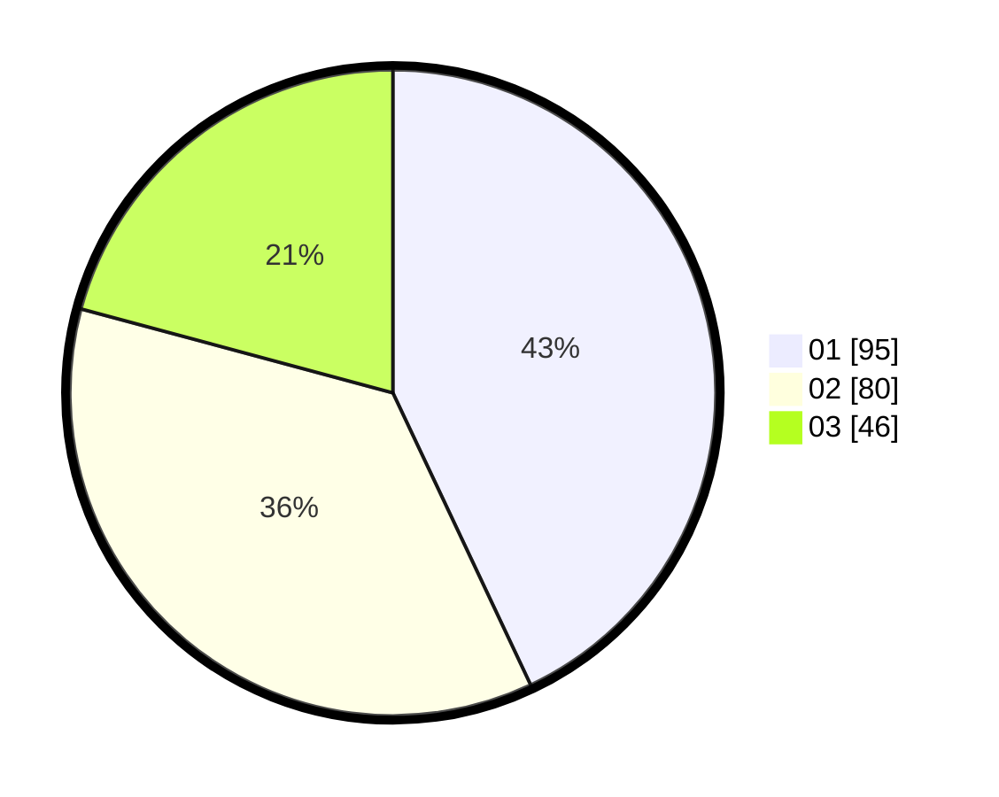

# Hasil

Hasil perolehan suara paslon dapat dilihat pada file paslon-01.txt, paslon-02.txt, dan paslon-03.txt.

Jika tidak ada, artinya data tersebut belum ada pada SIREKAP.

## Perolehan Suara

 * Paslon 01: **95**.
 * Paslon 02: **80**.
 * Paslon 03: **46**.

## Foto C Plano

https://sirekap-obj-formc.kpu.go.id/db44/pemilu/ppwp/31/71/03/10/06/3171031006066-20240214-195333--66415805-4b1e-4992-aa0a-7fe2fb0934b7.jpg

https://sirekap-obj-formc.kpu.go.id/db44/pemilu/ppwp/31/71/03/10/06/3171031006066-20240214-195454--dee1a930-2713-4c10-a1d2-cd3188ad766e.jpg

https://sirekap-obj-formc.kpu.go.id/db44/pemilu/ppwp/31/71/03/10/06/3171031006066-20240214-195847--9d7be51a-6c1d-4a9d-bc39-d08380647e7d.jpg

## DATA PEMILIH TETAP

Jumlah pemilih dalam DPT: **278**.
 * L: **134**.
 * P: **144**.

## DATA PENGGUNA HAK PILIH

Jumlah pengguna hak pilih dalam DPT: **224**.
 * L: **99**.
 * P: **125**.

Jumlah pengguna hak pilih dalam DPTb: **1**.
 * L: **1**.
 * P: **0**.

Jumlah pengguna hak pilih dalam DPK: **0**.
 * L: **0**.
 * P: **0**.

Jumlah pengguna hak pilih: **225**.
 * L: **100**.
 * P: **125**.

## JUMLAH SUARA SAH DAN TIDAK SAH

JUMLAH SELURUH SUARA SAH: **221**.

JUMLAH SUARA TIDAK SAH: **4**.

JUMLAH SELURUH SUARA SAH DAN SUARA TIDAK SAH: **225**.
