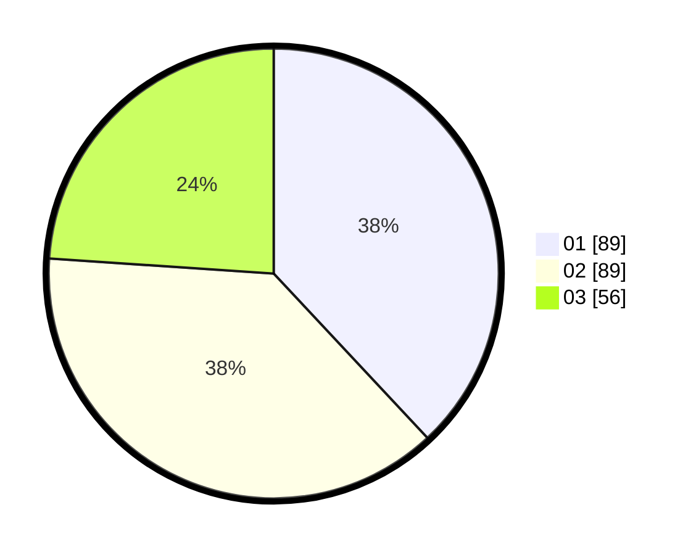

# Hasil

Hasil perolehan suara paslon dapat dilihat pada file paslon-01.txt, paslon-02.txt, dan paslon-03.txt.

Jika tidak ada, artinya data tersebut belum ada pada SIREKAP.

## Perolehan Suara

 * Paslon 01: **89**.
 * Paslon 02: **89**.
 * Paslon 03: **56**.

## Foto C Plano

https://sirekap-obj-formc.kpu.go.id/48e5/pemilu/ppwp/31/71/03/10/06/3171031006067-20240215-133318--89ac70a8-1dab-4d9c-a043-12961dcdbc14.jpg

https://sirekap-obj-formc.kpu.go.id/48e5/pemilu/ppwp/31/71/03/10/06/3171031006067-20240215-133339--f6ff46da-1d75-4337-a847-241caaaefbce.jpg

https://sirekap-obj-formc.kpu.go.id/48e5/pemilu/ppwp/31/71/03/10/06/3171031006067-20240215-133329--9b2846ab-75e5-47d0-97aa-040d8ef53fc4.jpg

## DATA PEMILIH TETAP

Jumlah pemilih dalam DPT: **274**.
 * L: **134**.
 * P: **140**.

## DATA PENGGUNA HAK PILIH

Jumlah pengguna hak pilih dalam DPT: **225**.
 * L: **108**.
 * P: **117**.

Jumlah pengguna hak pilih dalam DPTb: **8**.
 * L: **4**.
 * P: **4**.

Jumlah pengguna hak pilih dalam DPK: **4**.
 * L: **3**.
 * P: **1**.

Jumlah pengguna hak pilih: **237**.
 * L: **115**.
 * P: **122**.

## JUMLAH SUARA SAH DAN TIDAK SAH

JUMLAH SELURUH SUARA SAH: **234**.

JUMLAH SUARA TIDAK SAH: **3**.

JUMLAH SELURUH SUARA SAH DAN SUARA TIDAK SAH: **237**.
