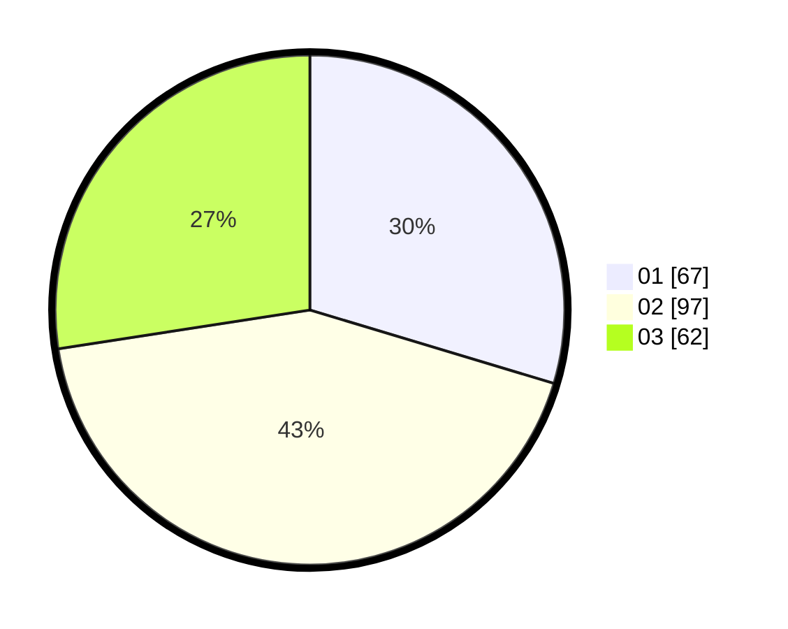

# Hasil

Hasil perolehan suara paslon dapat dilihat pada file paslon-01.txt, paslon-02.txt, dan paslon-03.txt.

Jika tidak ada, artinya data tersebut belum ada pada SIREKAP.

## Perolehan Suara

 * Paslon 01: **67**.
 * Paslon 02: **97**.
 * Paslon 03: **62**.

## Foto C Plano

https://sirekap-obj-formc.kpu.go.id/cc54/pemilu/ppwp/31/71/03/10/06/3171031006068-20240215-235733--9c00417d-4367-421b-89c9-99e78b8e9dbd.jpg

https://sirekap-obj-formc.kpu.go.id/cc54/pemilu/ppwp/31/71/03/10/06/3171031006068-20240215-235735--93460129-fe5e-4ff8-8d7a-5acfe7326dac.jpg

https://sirekap-obj-formc.kpu.go.id/cc54/pemilu/ppwp/31/71/03/10/06/3171031006068-20240215-235734--9751e438-72a2-43e6-8c84-8ea975c994a5.jpg

## DATA PEMILIH TETAP

Jumlah pemilih dalam DPT: **284**.
 * L: **144**.
 * P: **140**.

## DATA PENGGUNA HAK PILIH

Jumlah pengguna hak pilih dalam DPT: **213**.
 * L: **99**.
 * P: **114**.

Jumlah pengguna hak pilih dalam DPTb: **10**.
 * L: **4**.
 * P: **6**.

Jumlah pengguna hak pilih dalam DPK: **5**.
 * L: **3**.
 * P: **2**.

Jumlah pengguna hak pilih: **228**.
 * L: **106**.
 * P: **122**.

## JUMLAH SUARA SAH DAN TIDAK SAH

JUMLAH SELURUH SUARA SAH: **226**.

JUMLAH SUARA TIDAK SAH: **2**.

JUMLAH SELURUH SUARA SAH DAN SUARA TIDAK SAH: **228**.
