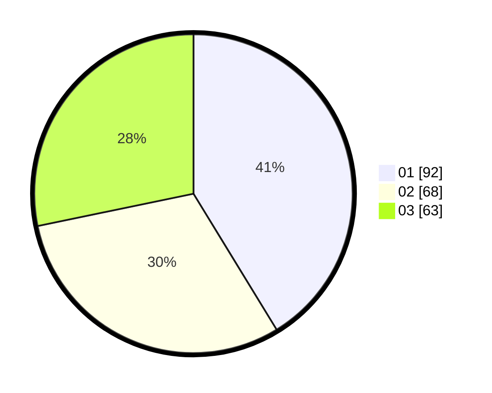

# Hasil

Hasil perolehan suara paslon dapat dilihat pada file paslon-01.txt, paslon-02.txt, dan paslon-03.txt.

Jika tidak ada, artinya data tersebut belum ada pada SIREKAP.

## Perolehan Suara

 * Paslon 01: **92**.
 * Paslon 02: **68**.
 * Paslon 03: **63**.

## Foto C Plano

https://sirekap-obj-formc.kpu.go.id/01d6/pemilu/ppwp/31/71/03/10/06/3171031006070-20240215-004844--ddb6ee8c-e02a-409c-9f94-661ff2abc2ca.jpg

https://sirekap-obj-formc.kpu.go.id/01d6/pemilu/ppwp/31/71/03/10/06/3171031006070-20240215-005518--f9b3de67-e07f-44db-86f1-095814469bef.jpg

https://sirekap-obj-formc.kpu.go.id/01d6/pemilu/ppwp/31/71/03/10/06/3171031006070-20240215-005607--6640ada9-7c12-4fba-97ae-07fc056b5c2f.jpg
