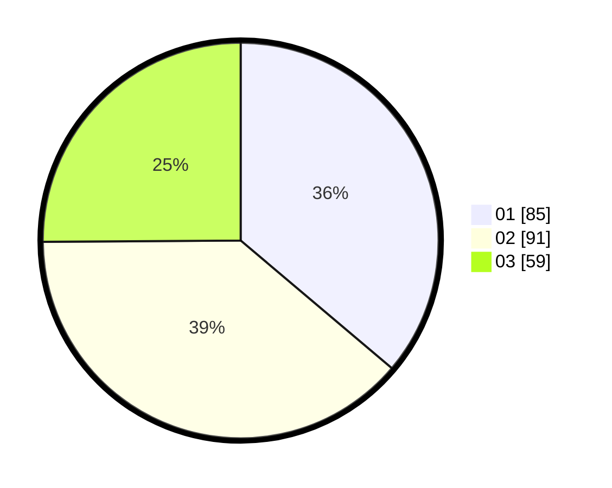

# Hasil

Hasil perolehan suara paslon dapat dilihat pada file paslon-01.txt, paslon-02.txt, dan paslon-03.txt.

Jika tidak ada, artinya data tersebut belum ada pada SIREKAP.

## Perolehan Suara

 * Paslon 01: **85**.
 * Paslon 02: **91**.
 * Paslon 03: **59**.

## Foto C Plano

https://sirekap-obj-formc.kpu.go.id/9199/pemilu/ppwp/31/71/03/10/06/3171031006072-20240214-214002--feb5f2c1-be5f-4a12-8423-e313648a1bb3.jpg

https://sirekap-obj-formc.kpu.go.id/9199/pemilu/ppwp/31/71/03/10/06/3171031006072-20240214-213613--ee56dafb-0a92-453c-afa1-ac53fec00f13.jpg

https://sirekap-obj-formc.kpu.go.id/9199/pemilu/ppwp/31/71/03/10/06/3171031006072-20240214-213229--876c9a53-9402-4c9f-a07d-5bf43299db12.jpg
