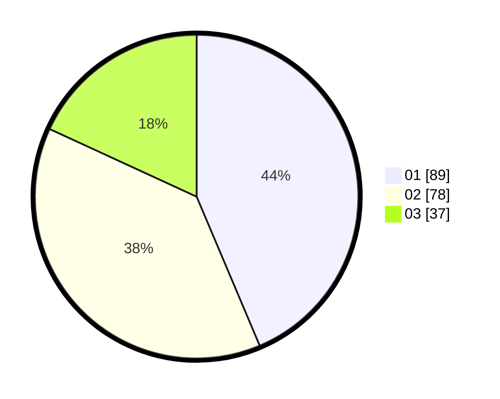

# Hasil

Hasil perolehan suara paslon dapat dilihat pada file paslon-01.txt, paslon-02.txt, dan paslon-03.txt.

Jika tidak ada, artinya data tersebut belum ada pada SIREKAP.

## Perolehan Suara

 * Paslon 01: **89**.
 * Paslon 02: **78**.
 * Paslon 03: **37**.

## Foto C Plano

https://sirekap-obj-formc.kpu.go.id/d71a/pemilu/ppwp/31/71/03/10/06/3171031006073-20240216-152120--35972d31-d7de-4238-8f78-460a6e8ed438.jpg

https://sirekap-obj-formc.kpu.go.id/d71a/pemilu/ppwp/31/71/03/10/06/3171031006073-20240216-152121--8edcddc0-ffca-4aee-8fb3-087f5a616abb.jpg

https://sirekap-obj-formc.kpu.go.id/d71a/pemilu/ppwp/31/71/03/10/06/3171031006073-20240216-152120--3985c4ff-f2ac-4557-81d0-7923773ad871.jpg

## DATA PEMILIH TETAP

Jumlah pemilih dalam DPT: **202**.
 * L: **96**.
 * P: **106**.

## DATA PENGGUNA HAK PILIH

Jumlah pengguna hak pilih dalam DPT: **202**.
 * L: **96**.
 * P: **106**.

Jumlah pengguna hak pilih dalam DPTb: **1**.
 * L: **1**.
 * P: **0**.

Jumlah pengguna hak pilih dalam DPK: **2**.
 * L: **1**.
 * P: **1**.

Jumlah pengguna hak pilih: **205**.
 * L: **98**.
 * P: **107**.

## JUMLAH SUARA SAH DAN TIDAK SAH

JUMLAH SELURUH SUARA SAH: **204**.

JUMLAH SUARA TIDAK SAH: **1**.

JUMLAH SELURUH SUARA SAH DAN SUARA TIDAK SAH: **205**.
