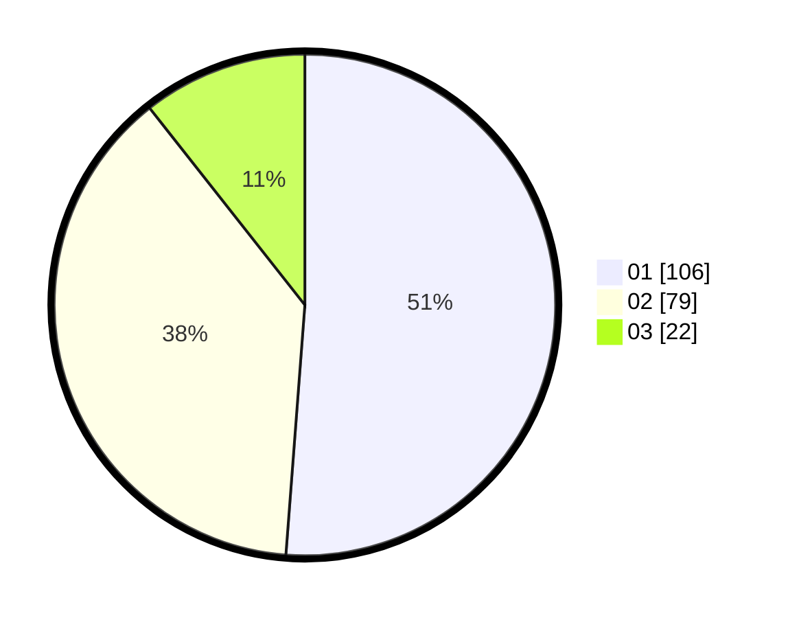

# Hasil

Hasil perolehan suara paslon dapat dilihat pada file paslon-01.txt, paslon-02.txt, dan paslon-03.txt.

Jika tidak ada, artinya data tersebut belum ada pada SIREKAP.

## Perolehan Suara

 * Paslon 01: **106**.
 * Paslon 02: **79**.
 * Paslon 03: **22**.

## Foto C Plano

https://sirekap-obj-formc.kpu.go.id/9b3c/pemilu/ppwp/31/71/03/10/06/3171031006078-20240215-004900--fef202da-3a1e-4b52-addf-d17111bea6ae.jpg

https://sirekap-obj-formc.kpu.go.id/9b3c/pemilu/ppwp/31/71/03/10/06/3171031006078-20240215-004405--bd181bae-d7ee-44e3-9db5-203b4d0c2b08.jpg

https://sirekap-obj-formc.kpu.go.id/9b3c/pemilu/ppwp/31/71/03/10/06/3171031006078-20240215-005244--3ad1622d-5fbb-453a-b2c0-f3a948985b24.jpg
