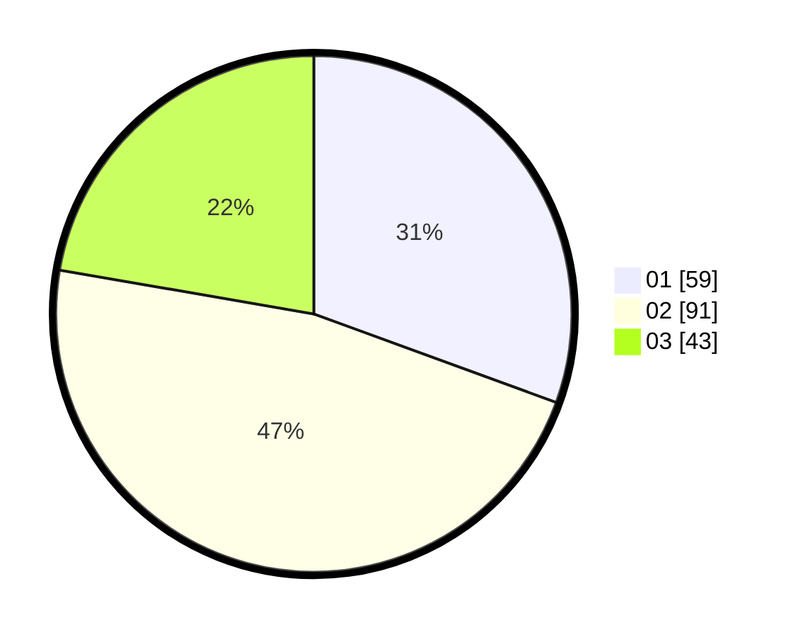

# Hasil

Hasil perolehan suara paslon dapat dilihat pada file paslon-01.txt, paslon-02.txt, dan paslon-03.txt.

Jika tidak ada, artinya data tersebut belum ada pada SIREKAP.

## Perolehan Suara

 * Paslon 01: **59**.
 * Paslon 02: **91**.
 * Paslon 03: **43**.

## Foto C Plano

https://sirekap-obj-formc.kpu.go.id/afca/pemilu/ppwp/31/71/03/10/06/3171031006080-20240215-221958--1f11c87e-b9ba-429f-9397-3a6a9581d5a8.jpg

https://sirekap-obj-formc.kpu.go.id/afca/pemilu/ppwp/31/71/03/10/06/3171031006080-20240215-221959--a1f5631a-0366-4698-b6ad-1a293530f562.jpg

https://sirekap-obj-formc.kpu.go.id/afca/pemilu/ppwp/31/71/03/10/06/3171031006080-20240215-221958--bb18f1bb-dc9b-46ac-8a1e-c28d9f67808b.jpg

## DATA PEMILIH TETAP

Jumlah pemilih dalam DPT: **277**.
 * L: **141**.
 * P: **136**.

## DATA PENGGUNA HAK PILIH

Jumlah pengguna hak pilih dalam DPT: **194**.
 * L: **95**.
 * P: **99**.

Jumlah pengguna hak pilih dalam DPTb: **0**.
 * L: **0**.
 * P: **0**.

Jumlah pengguna hak pilih dalam DPK: **0**.
 * L: **0**.
 * P: **0**.

Jumlah pengguna hak pilih: **194**.
 * L: **95**.
 * P: **99**.

## JUMLAH SUARA SAH DAN TIDAK SAH

JUMLAH SELURUH SUARA SAH: **193**.

JUMLAH SUARA TIDAK SAH: **1**.

JUMLAH SELURUH SUARA SAH DAN SUARA TIDAK SAH: **194**.
